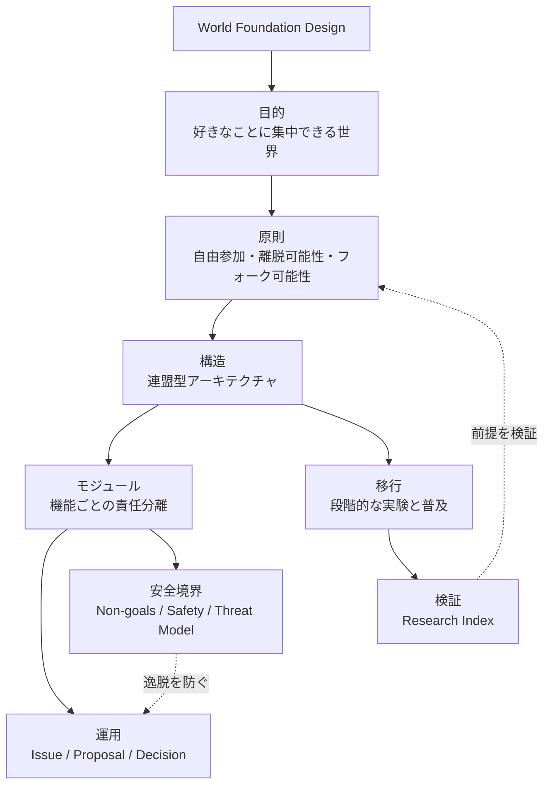

# World Foundation Design

World Foundation Designは、全ての人が好きなことに集中できる世界を目指すための、オープンな社会設計リポジトリです。

このリポジトリでは、理想的な世界の思想、原則、アーキテクチャ、モジュール、提案、意思決定、調査資料を管理します。社会制度や協力基盤を、ソフトウェア設計と同じようにIssue、Pull Request、Proposal、Decision、Glossary、Moduleへ分解し、複数人でレビューできる形にします。

この設計は、特定の組織名やブランドを広めるためのものではありません。目的は、個人や組織が自由に参加し、協力し、離脱し、必要であればフォークできる協力基盤を設計することです。

## 全体像

World Foundation Designは、目的、原則、構造、モジュール、運用、安全境界、移行計画を分けて扱います。

基本設計は [docs/ja/README.md](docs/ja/README.md) にまとめています。図表は [assets/diagrams/](assets/diagrams/) にあります。Mermaidが読みにくい場合は、[Visual Link Map](assets/diagrams/visual-link-map.svg) から主要文書へ直接移動できます。

## 名称について

`Acecore` はこの構想の初期コードネームとして扱います。

このリポジトリの主語は、特定の名称ではなく「よりよい世界の設計」そのものです。将来的に、別の名称、複数の実装、地域ごとの呼び方、フォークされた設計が生まれても構いません。

## 初期方針

- 日本語ファーストで議論速度を保つ
- 英語対応を最初から想定する
- IssueとPull Requestによる設計レビューを行う
- 用語集によって思想と表現の一貫性を保つ
- モジュールごとに責任を分離する
- 透明性、離脱可能性、フォーク可能性、腐敗耐性を重視する
- 国家との敵対ではなく、国家が担う必要のある機能を段階的に減らす設計を考える

## 貢献方法

問題提起、アイデア、提案、翻訳、調査、文章改善はすべて歓迎します。

1. Issueで問題やアイデアを共有する
2. 必要に応じて `proposals/` に提案を書く
3. Pull Requestで変更をレビューする
4. 重要な判断は `decisions/` に記録する

## ディレクトリ

- `CODE_OF_CONDUCT.md`: 参加者の行動規範
- `SAFETY.md`: 誤用・悪用を避けるための安全方針
- `docs/`: 基本設計文書
- `modules/`: 機能ごとの設計メモ
- `glossary/`: 用語集
- `proposals/`: 設計変更や新しい仕組みの提案
- `decisions/`: 重要な意思決定の記録
- `research/`: 関連する調査資料
- `assets/`: 図表や説明用素材
- `meta/`: 初期生成プロンプトなど、設計本文ではない運用記録

`docs/` にはVision、Principles、Architecture、Roadmap、Non-goals、Threat Model、Life Access Sustainability、Translation Statusを置きます。

`modules/` にはIdentity、Reputation、Economy、Welfare、Governance、Arbitration、Infrastructure、Audit、Norms、Public Safety、Federationを置きます。

`research/` には調査メモとResearch Indexを置きます。

`meta/issue-drafts/` には、GitHub Issueとして作成する前の下書きを置きます。

`meta/handoffs/` には、次回作業へ渡す引継ぎ記録を置きます。

## 図表

構造を把握しやすくするため、`assets/diagrams/` に図表を置いています。現時点ではレビューしやすいMermaidを中心にしていますが、主要な全体図やリンク索引にはSVG、議論用にはExcalidraw、複雑な清書にはdraw.ioなども使います。

- [Visual Link Map](assets/diagrams/visual-link-map.svg): 主要文書、モジュール、Proposal、Decision、Glossaryへ移動できるクリック可能な索引
- [Diagrams README](assets/diagrams/README.md): 図表一覧、表現形式、図と文書のリンク方針

- [00-world-design-overview.md](assets/diagrams/00-world-design-overview.md): 世界設計の全体像
- [01-cooperation-foundation-layers.md](assets/diagrams/01-cooperation-foundation-layers.md): 協力基盤の層構造
- [02-module-relationships.md](assets/diagrams/02-module-relationships.md): モジュール関係図
- [03-governance-process.md](assets/diagrams/03-governance-process.md): ガバナンスフロー
- [04-transition-roadmap.md](assets/diagrams/04-transition-roadmap.md): 段階的移行ロードマップ
- [05-risk-and-safety-loops.md](assets/diagrams/05-risk-and-safety-loops.md): 腐敗耐性と安全装置
- [06-multilingual-document-flow.md](assets/diagrams/06-multilingual-document-flow.md): 日本語正本と翻訳の管理フロー
- [07-life-access-model.md](assets/diagrams/07-life-access-model.md): 生活アクセスの設計モデル
- [08-non-coercive-adoption.md](assets/diagrams/08-non-coercive-adoption.md): 非強制の普及モデル
- [09-expanded-module-map.md](assets/diagrams/09-expanded-module-map.md): 拡張モジュール関係図

## 注意

この設計は、カルト、帝国、政府、独裁組織、閉鎖共同体のように見えてはいけません。

常に、自由参加、透明性、離脱可能性、フォーク可能性、多重所属を重視します。強制ではなく、利便性と信頼性によって自然に選ばれる協力基盤を目指します。
