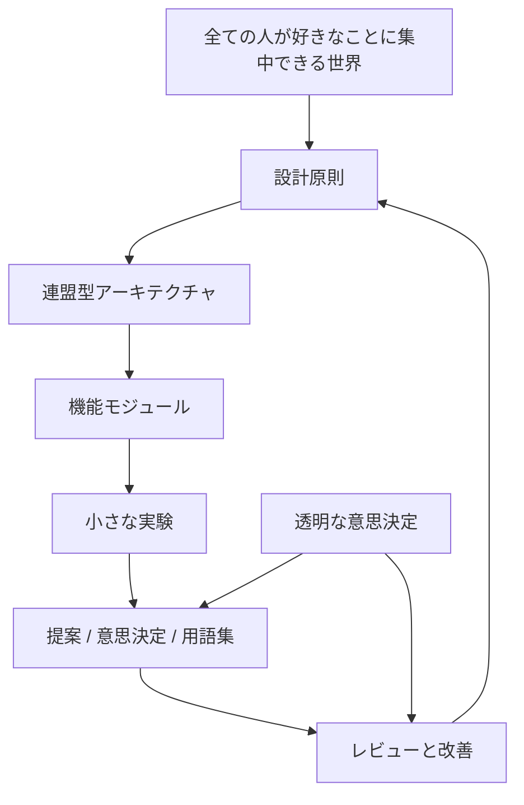

# 世界設計の全体像

この図は、World Foundation Designが何を中心に置くかを示します。目的は [ビジョン](../../docs/ja/00-vision.md)、設計原則は [設計原則](../../docs/ja/01-principles.md)、構造は [アーキテクチャ](../../docs/ja/02-architecture.md) に分けます。クリック可能な全体索引は [visual-link-map.svg](visual-link-map.svg) です。

