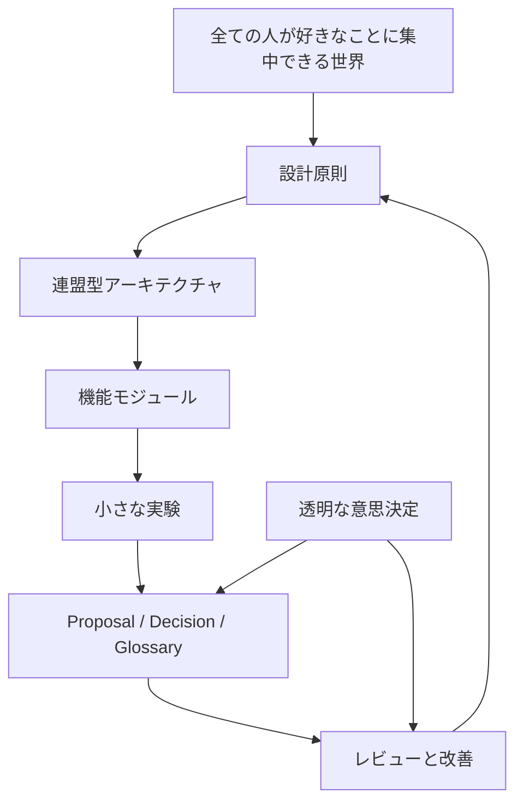

# World Design Overview

この図は、World Foundation Designが何を中心に置くかを示します。

```mermaid
flowchart TB
  Vision["全ての人が好きなことに集中できる世界"]
  Principles["設計原則"]
  Architecture["連盟型アーキテクチャ"]
  Modules["機能モジュール"]
  Governance["透明な意思決定"]
  Experiments["小さな実験"]
  Records["Proposal / Decision / Glossary"]
  Feedback["レビューと改善"]

  Vision --> Principles
  Principles --> Architecture
  Architecture --> Modules
  Modules --> Experiments
  Experiments --> Records
  Records --> Feedback
  Feedback --> Principles
  Governance --> Records
  Governance --> Feedback
```
