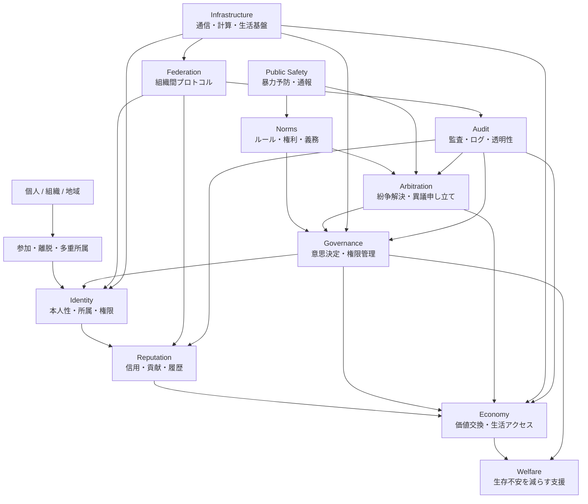

# Cooperation Foundation Layers

この図は、協力基盤を層として分けて考えるための初期モデルです。

```mermaid
flowchart TB
  People["個人 / 組織 / 地域"]
  Interface["参加・離脱・多重所属"]
  Identity["Identity<br/>本人性・所属・権限"]
  Reputation["Reputation<br/>信用・貢献・履歴"]
  Economy["Economy<br/>価値交換・生活アクセス"]
  Welfare["Welfare<br/>生存不安を減らす支援"]
  Governance["Governance<br/>意思決定・権限管理"]
  Arbitration["Arbitration<br/>紛争解決・異議申し立て"]
  Infrastructure["Infrastructure<br/>通信・計算・生活基盤"]
  Audit["Audit<br/>監査・ログ・透明性"]
  Norms["Norms<br/>ルール・権利・義務"]
  PublicSafety["Public Safety<br/>暴力予防・通報"]
  Federation["Federation<br/>組織間プロトコル"]

  People --> Interface
  Interface --> Identity
  Identity --> Reputation
  Reputation --> Economy
  Economy --> Welfare
  Governance --> Identity
  Governance --> Economy
  Governance --> Welfare
  Norms --> Governance
  Norms --> Arbitration
  Arbitration --> Governance
  Arbitration --> Economy
  PublicSafety --> Arbitration
  PublicSafety --> Norms
  Federation --> Identity
  Federation --> Reputation
  Federation --> Audit
  Infrastructure --> Identity
  Infrastructure --> Governance
  Infrastructure --> Economy
  Infrastructure --> Federation
  Audit --> Governance
  Audit --> Economy
  Audit --> Arbitration
  Audit --> Reputation
```
