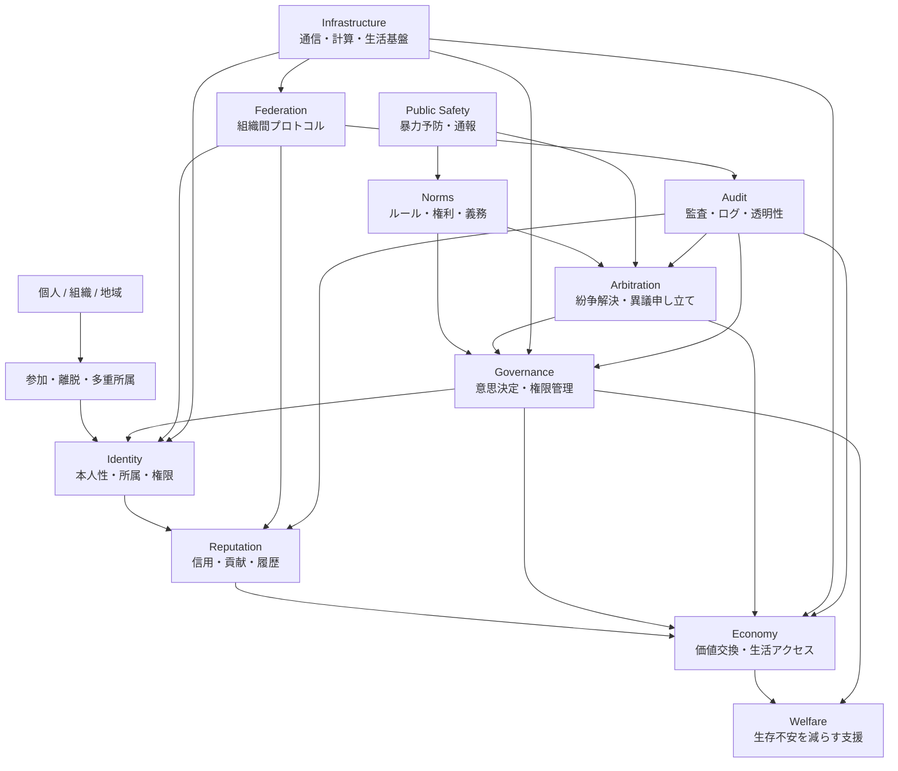

# Cooperation Foundation Layers

この図は、[Architecture](../../docs/ja/02-architecture.md) で説明する協力基盤を層として分けるための初期モデルです。各層の詳細は [modules/ja](../../modules/ja/README.md) に置き、責任侵食のリスクは [Threat Model](../../docs/ja/05-threat-model.md) で扱います。

