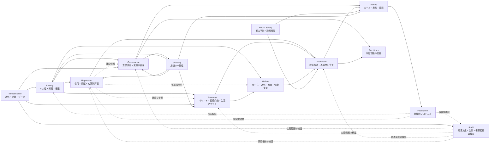

# Module Relationships

この図は、[modules/ja](../../modules/ja/README.md) の初期モジュール同士の関係を示します。矢印は支配関係ではなく、[Architecture](../../docs/ja/02-architecture.md) が前提にする参照・連携・検証の関係です。

Reputationは全アクセスを支配するためのものではありません。Auditも全てを監視するためのものではなく、定義された範囲を検証可能にするための仕組みです。この境界が崩れるリスクは [Threat Model](../../docs/ja/05-threat-model.md) と [Non-goals](../../docs/ja/04-non-goals.md) で扱います。

