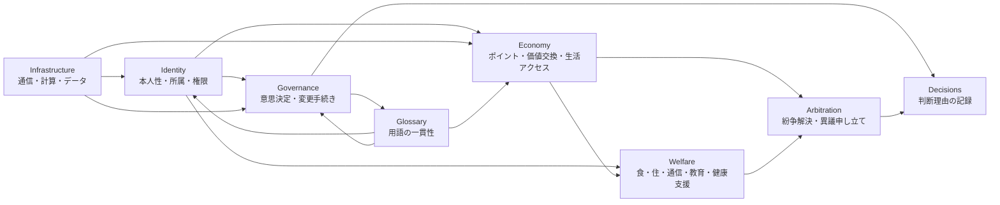

# Module Relationships

この図は、初期モジュール同士の関係を示します。矢印は支配関係ではなく、参照・連携・記録の関係です。

```mermaid
flowchart LR
  Identity["Identity<br/>本人性・所属・権限"]
  Economy["Economy<br/>ポイント・価値交換・生活アクセス"]
  Welfare["Welfare<br/>食・住・通信・教育・健康支援"]
  Governance["Governance<br/>意思決定・変更手続き"]
  Arbitration["Arbitration<br/>紛争解決・異議申し立て"]
  Infrastructure["Infrastructure<br/>通信・計算・データ"]
  Glossary["Glossary<br/>用語の一貫性"]
  Decisions["Decisions<br/>判断理由の記録"]

  Identity --> Governance
  Identity --> Welfare
  Identity --> Economy
  Economy --> Welfare
  Economy --> Arbitration
  Welfare --> Arbitration
  Governance --> Decisions
  Governance --> Glossary
  Arbitration --> Decisions
  Infrastructure --> Identity
  Infrastructure --> Economy
  Infrastructure --> Governance
  Glossary --> Identity
  Glossary --> Economy
  Glossary --> Governance
```
