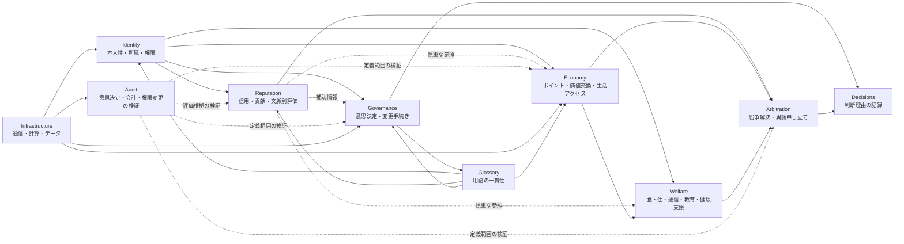

# Module Relationships

この図は、初期モジュール同士の関係を示します。矢印は支配関係ではなく、参照・連携・検証の関係です。

Reputationは全アクセスを支配するためのものではありません。Auditも全てを監視するためのものではなく、定義された範囲を検証可能にするための仕組みです。

```mermaid
flowchart LR
  Identity["Identity<br/>本人性・所属・権限"]
  Reputation["Reputation<br/>信用・貢献・文脈別評価"]
  Economy["Economy<br/>ポイント・価値交換・生活アクセス"]
  Welfare["Welfare<br/>食・住・通信・教育・健康支援"]
  Governance["Governance<br/>意思決定・変更手続き"]
  Arbitration["Arbitration<br/>紛争解決・異議申し立て"]
  Infrastructure["Infrastructure<br/>通信・計算・データ"]
  Audit["Audit<br/>意思決定・会計・権限変更の検証"]
  Glossary["Glossary<br/>用語の一貫性"]
  Decisions["Decisions<br/>判断理由の記録"]

  Identity --> Reputation
  Identity --> Governance
  Identity --> Welfare
  Identity --> Economy
  Reputation -. "補助情報" .-> Governance
  Reputation -. "慎重な参照" .-> Economy
  Reputation -. "慎重な参照" .-> Welfare
  Reputation --> Arbitration
  Economy --> Welfare
  Economy --> Arbitration
  Welfare --> Arbitration
  Governance --> Decisions
  Governance --> Glossary
  Arbitration --> Decisions
  Audit -. "定義範囲の検証" .-> Governance
  Audit -. "定義範囲の検証" .-> Economy
  Audit -. "定義範囲の検証" .-> Arbitration
  Audit -. "評価根拠の検証" .-> Reputation
  Infrastructure --> Identity
  Infrastructure --> Economy
  Infrastructure --> Governance
  Infrastructure --> Audit
  Glossary --> Identity
  Glossary --> Reputation
  Glossary --> Economy
  Glossary --> Governance
```
