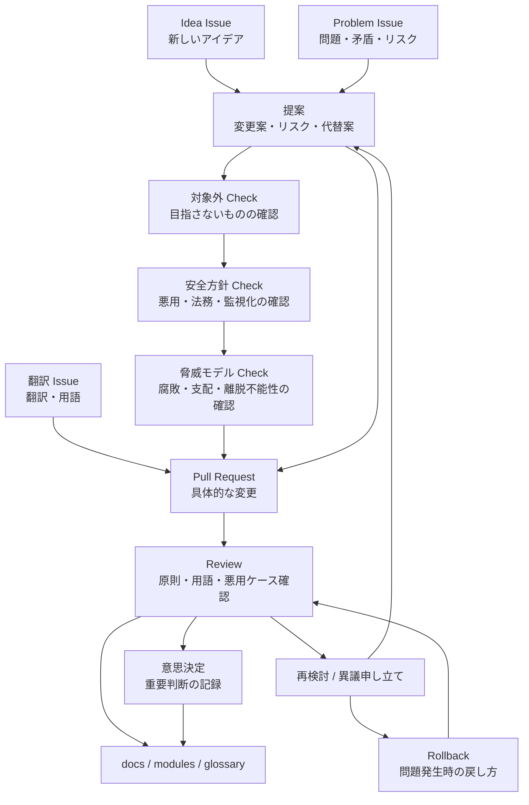

# ガバナンスプロセス

この図は、[Issue](https://github.com/acecore-systems/world-foundation/issues) から [提案](../../proposals/ja/README.md)、[Pull Request](https://github.com/acecore-systems/world-foundation/pulls)、[意思決定](../../decisions/ja/README.md) までの初期運用フローです。変更前に [対象外](../../docs/ja/04-non-goals.md)、[安全方針](../../SAFETY.md)、[脅威モデル](../../docs/ja/05-threat-model.md) を通す流れを含めます。

