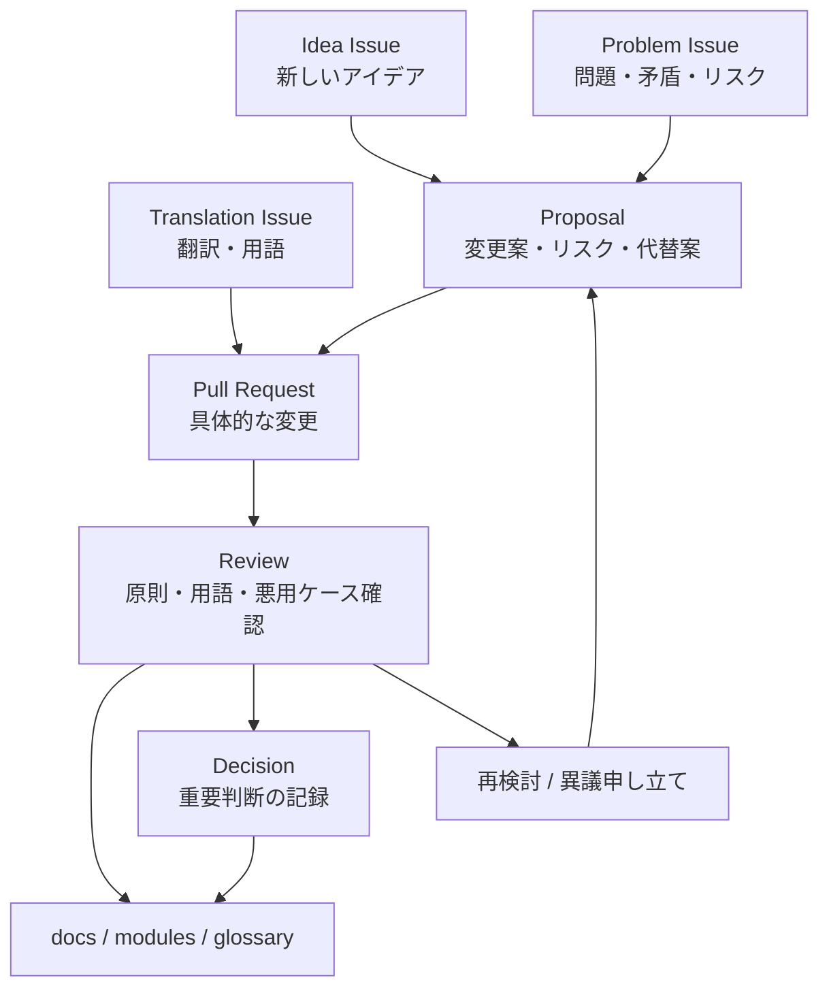

# Governance Process

この図は、IssueからProposal、Pull Request、Decisionまでの初期運用フローです。

```mermaid
flowchart TD
  Idea["Idea Issue<br/>新しいアイデア"]
  Problem["Problem Issue<br/>問題・矛盾・リスク"]
  Translation["Translation Issue<br/>翻訳・用語"]
  Proposal["Proposal<br/>変更案・リスク・代替案"]
  PullRequest["Pull Request<br/>具体的な変更"]
  Review["Review<br/>原則・用語・悪用ケース確認"]
  Decision["Decision<br/>重要判断の記録"]
  Docs["docs / modules / glossary"]
  Reopen["再検討 / 異議申し立て"]

  Idea --> Proposal
  Problem --> Proposal
  Translation --> PullRequest
  Proposal --> PullRequest
  PullRequest --> Review
  Review --> Docs
  Review --> Decision
  Decision --> Docs
  Review --> Reopen
  Reopen --> Proposal
```
