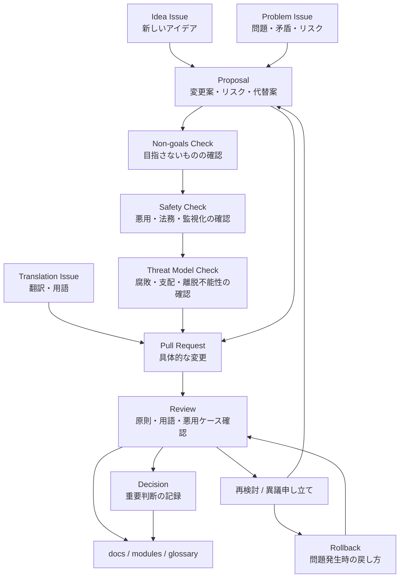

# Governance Process

この図は、Issueから [Proposal](../../proposals/ja/README.md)、Pull Request、[Decision](../../decisions/ja/README.md) までの初期運用フローです。変更前に [Non-goals](../../docs/ja/04-non-goals.md)、[SAFETY](../../SAFETY.md)、[Threat Model](../../docs/ja/05-threat-model.md) を通す流れを含めます。

