# 移行ロードマップ

この図は、[ロードマップ](../../docs/ja/03-roadmap.md) のフェーズを、既存制度から協力基盤へ段階的に移行する流れとして示します。普及は [設計原則](../../docs/ja/01-principles.md) の「強制ではなく利便性」に従い、前提検証は [research/ja](../../research/ja/README.md) に戻します。

```mermaid
flowchart LR
  Current["現在の社会<br/>国家・企業・地域・家族・雇用への強い依存"]
  P0["フェーズ 0<br/>設計基盤<br/>安全方針 / 対象外 / 脅威モデル"]
  P1["フェーズ 1<br/>初期組織と運用実験"]
  P2["フェーズ 2<br/>モジュール実験<br/>評判 / 監査 / 規範 / 公共安全 / 連合を含む"]
  P3["フェーズ 3<br/>組織連盟"]
  P4["フェーズ 4<br/>世界共通協力基盤"]
  P5["フェーズ 5<br/>国家依存の縮小"]
  Future["好きなことに集中しやすい世界"]

  Current --> P0 --> P1 --> P2 --> P3 --> P4 --> P5 --> Future

  P0 -. "用語・原則・安全方針・意思決定" .-> P1
  P1 -. "小さな失敗の記録" .-> P2
  P2 -. "相互運用性・信用・監査・ルール・安全境界" .-> P3
  P3 -. "国境を超えた協力" .-> P4
  P4 -. "便利さによる自然な採用" .-> P5

  click Current "../../research/ja/index.md" "前提調査"
  click P0 "../../docs/ja/03-roadmap.md" "ロードマップ"
  click P1 "../../modules/ja/governance/README.md" "初期組織と運用実験"
  click P2 "../../modules/ja/README.md" "モジュール"
  click P3 "../../modules/ja/federation/README.md" "連合"
  click P4 "../../docs/ja/03-roadmap.md" "世界共通協力基盤"
  click P5 "../../assets/diagrams/08-non-coercive-adoption.md" "非強制の普及"
  click Future "../../docs/ja/00-vision.md" "ビジョン"
```

