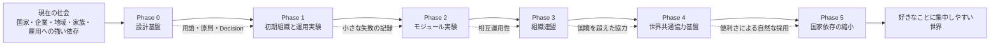

# Transition Roadmap

この図は、既存制度から協力基盤へ段階的に移行するイメージです。

```mermaid
flowchart LR
  Current["現在の社会<br/>国家・企業・地域・家族・雇用への強い依存"]
  P0["Phase 0<br/>設計基盤"]
  P1["Phase 1<br/>初期組織と運用実験"]
  P2["Phase 2<br/>モジュール実験"]
  P3["Phase 3<br/>組織連盟"]
  P4["Phase 4<br/>世界共通協力基盤"]
  P5["Phase 5<br/>国家依存の縮小"]
  Future["好きなことに集中しやすい世界"]

  Current --> P0 --> P1 --> P2 --> P3 --> P4 --> P5 --> Future

  P0 -. "用語・原則・Decision" .-> P1
  P1 -. "小さな失敗の記録" .-> P2
  P2 -. "相互運用性" .-> P3
  P3 -. "国境を超えた協力" .-> P4
  P4 -. "便利さによる自然な採用" .-> P5
```
