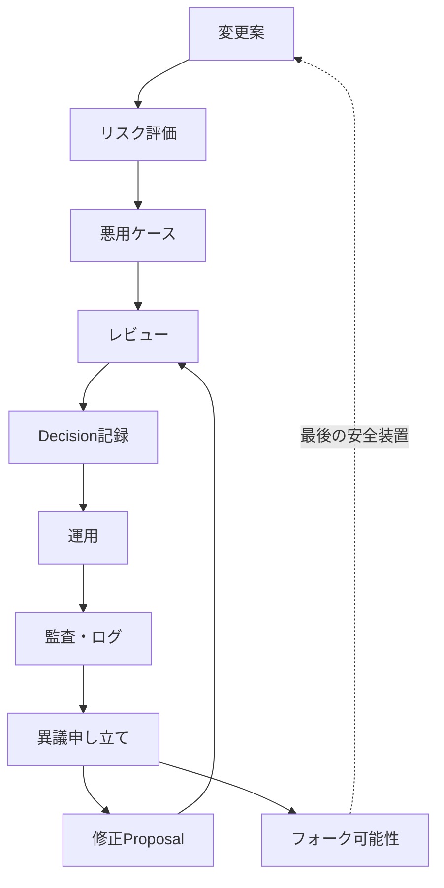

# Risk and Safety Loops

この図は、腐敗耐性、悪用ケース、異議申し立て、フォーク可能性を安全装置として扱う流れです。

```mermaid
flowchart TD
  Change["変更案"]
  Risk["リスク評価"]
  Abuse["悪用ケース"]
  Review["レビュー"]
  Decision["Decision記録"]
  Operation["運用"]
  Audit["監査・ログ"]
  Appeal["異議申し立て"]
  Fix["修正Proposal"]
  Fork["フォーク可能性"]

  Change --> Risk
  Risk --> Abuse
  Abuse --> Review
  Review --> Decision
  Decision --> Operation
  Operation --> Audit
  Audit --> Appeal
  Appeal --> Fix
  Fix --> Review
  Appeal --> Fork
  Fork -. "最後の安全装置" .-> Change
```
