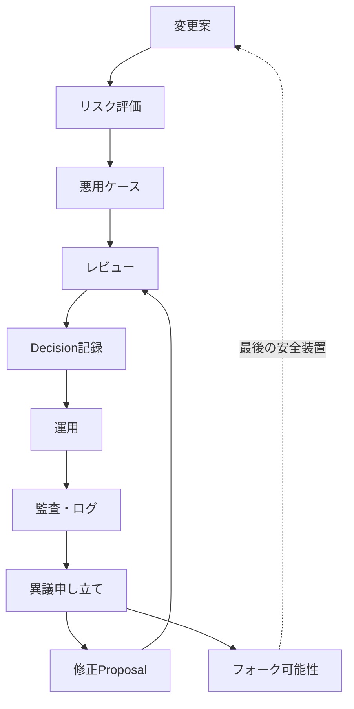

# Risk and Safety Loops

この図は、[Threat Model](../../docs/ja/05-threat-model.md) のリスク評価、[Non-goals](../../docs/ja/04-non-goals.md) と [SAFETY](../../SAFETY.md) の安全境界、[Audit](../../modules/ja/audit/README.md) と [Arbitration](../../modules/ja/arbitration/README.md) による異議申し立てを一つの安全装置として扱う流れです。

