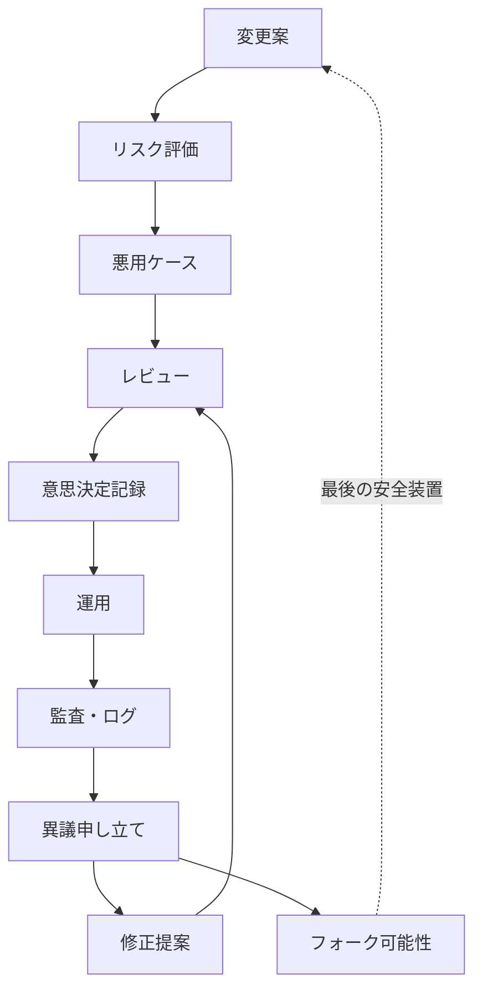

# リスクと安全性のループ

この図は、[脅威モデル](../../docs/ja/05-threat-model.md) のリスク評価、[対象外](../../docs/ja/04-non-goals.md) と [安全方針](../../SAFETY.md) の安全境界、[監査](../../modules/ja/audit/README.md) と [仲裁](../../modules/ja/arbitration/README.md) による異議申し立てを一つの安全装置として扱う流れです。

