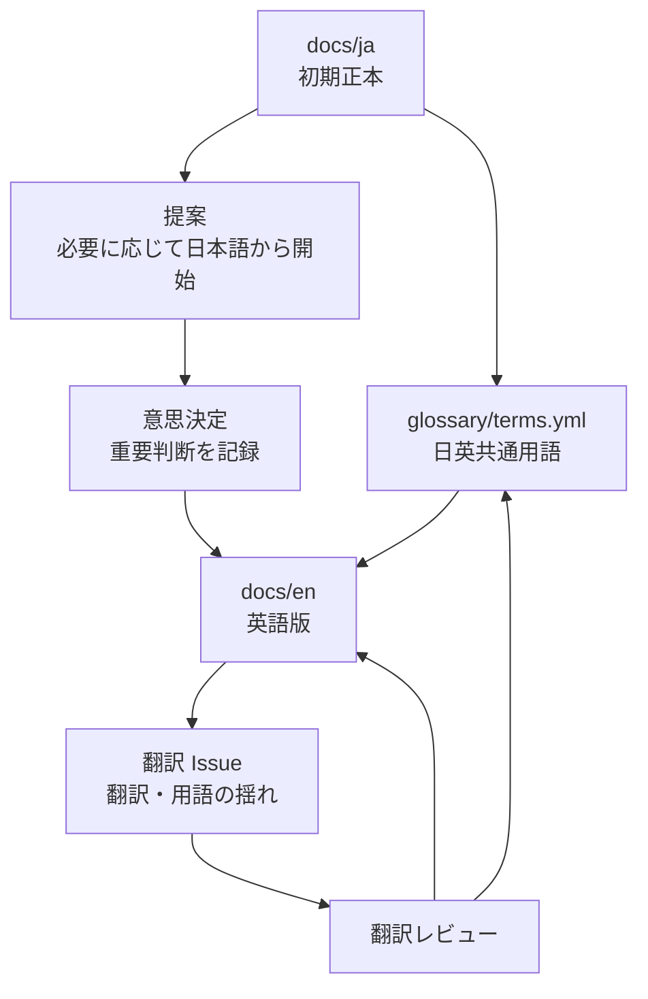

# 多言語ドキュメント運用

この図は、[日本語の設計文書](../../docs/ja/README.md) を初期正本とし、[日英共通用語](../../glossary/terms.yml) を通して [英語版文書](../../docs/en/README.md) へ反映する流れです。翻訳状態の管理は [翻訳ステータス](../../docs/ja/07-translation-status.md) に置きます。

