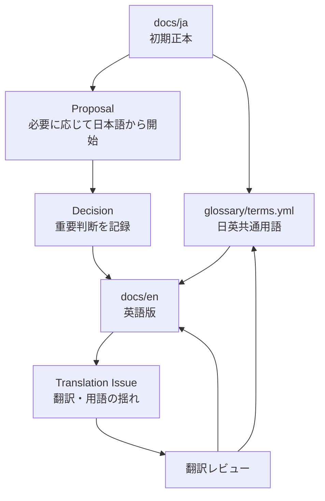

# Multilingual Document Flow

この図は、日本語正本と英語版を管理する初期方針です。

```mermaid
flowchart TD
  JA["docs/ja<br/>初期正本"]
  Glossary["glossary/terms.yml<br/>日英共通用語"]
  Proposal["Proposal<br/>必要に応じて日本語から開始"]
  Decision["Decision<br/>重要判断を記録"]
  EN["docs/en<br/>英語版"]
  TranslationIssue["Translation Issue<br/>翻訳・用語の揺れ"]
  Review["翻訳レビュー"]

  JA --> Glossary
  JA --> Proposal
  Proposal --> Decision
  Decision --> EN
  Glossary --> EN
  EN --> TranslationIssue
  TranslationIssue --> Review
  Review --> EN
  Review --> Glossary
```
