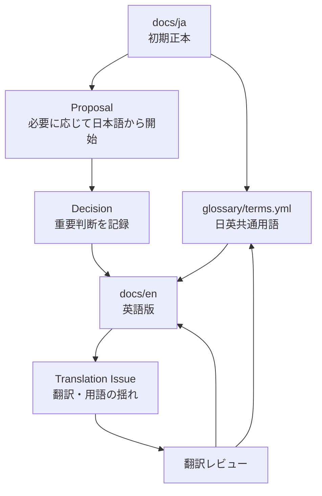

# Multilingual Document Flow

この図は、[docs/ja](../../docs/ja/README.md) を初期正本とし、[glossary/terms.yml](../../glossary/terms.yml) を通して [docs/en](../../docs/en/README.md) へ反映する流れです。翻訳状態の管理は [Translation Status](../../docs/ja/07-translation-status.md) に置きます。

