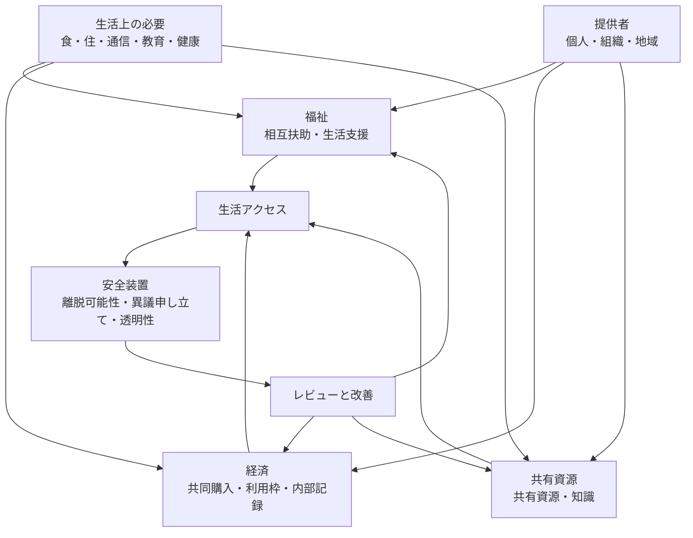

# 生活アクセスモデル

この図は、[生活アクセスの持続可能性](../../docs/ja/06-life-access-sustainability.md) の論点を、[福祉](../../modules/ja/welfare/README.md)、[経済](../../modules/ja/economy/README.md)、共有資源に分けて考える初期モデルです。支援が服従や囲い込みにならない境界は [脅威モデル](../../docs/ja/05-threat-model.md) で扱います。

