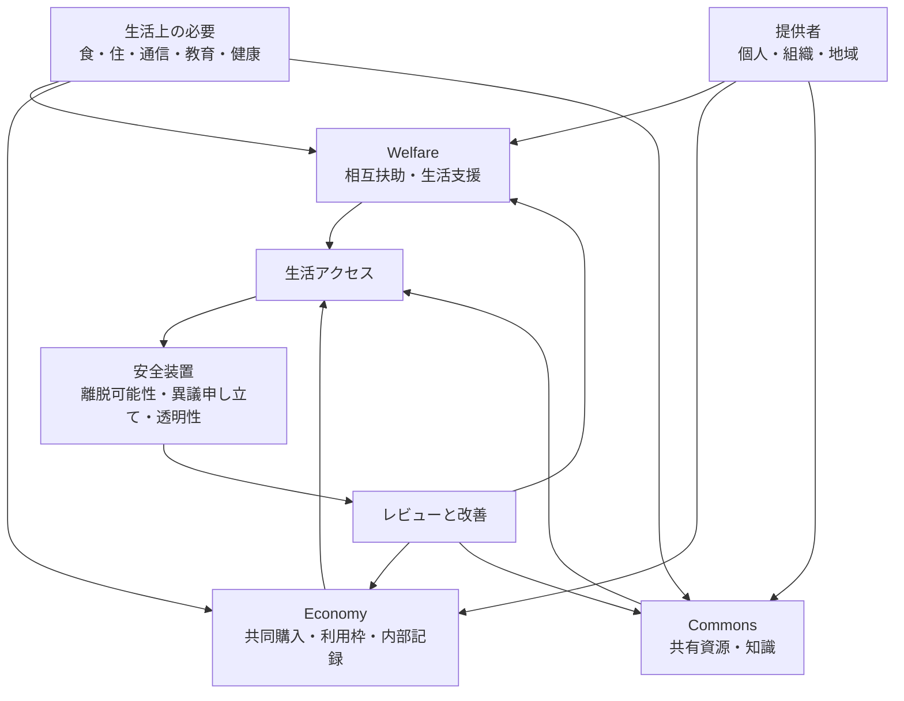

# Life Access Model

この図は、生活アクセスをポイント残高だけに閉じないための初期モデルです。

```mermaid
flowchart TB
  Needs["生活上の必要<br/>食・住・通信・教育・健康"]
  Welfare["Welfare<br/>相互扶助・生活支援"]
  Economy["Economy<br/>共同購入・利用枠・内部記録"]
  Commons["Commons<br/>共有資源・知識"]
  Providers["提供者<br/>個人・組織・地域"]
  Access["生活アクセス"]
  Safeguards["安全装置<br/>離脱可能性・異議申し立て・透明性"]
  Review["レビューと改善"]

  Needs --> Welfare
  Needs --> Economy
  Needs --> Commons
  Providers --> Welfare
  Providers --> Economy
  Providers --> Commons
  Welfare --> Access
  Economy --> Access
  Commons --> Access
  Access --> Safeguards
  Safeguards --> Review
  Review --> Welfare
  Review --> Economy
  Review --> Commons
```
