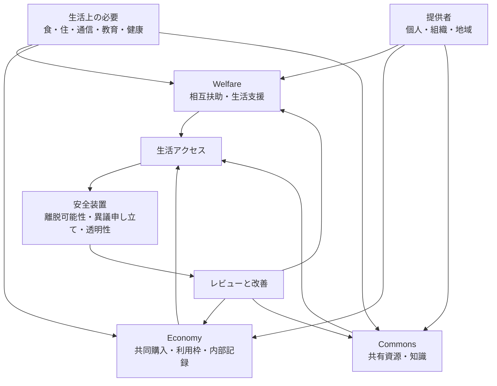

# Life Access Model

この図は、[Life Access Sustainability](../../docs/ja/06-life-access-sustainability.md) の論点を、[Welfare](../../modules/ja/welfare/README.md)、[Economy](../../modules/ja/economy/README.md)、共有資源に分けて考える初期モデルです。支援が服従や囲い込みにならない境界は [Threat Model](../../docs/ja/05-threat-model.md) で扱います。

