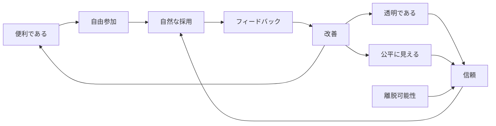

# Non-coercive Adoption

この図は、[Principles](../../docs/ja/01-principles.md) の「強制ではなく利便性」を、[Roadmap](../../docs/ja/03-roadmap.md) 上の普及モデルとして表したものです。便利さが実質的強制へ変わるリスクは [Threat Model](../../docs/ja/05-threat-model.md) で確認します。

