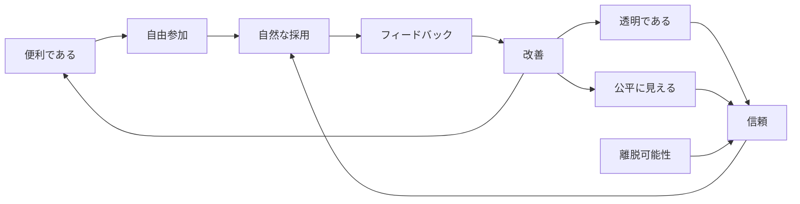

# Non-coercive Adoption

この図は、強制ではなく利便性と信頼性によって協力基盤が広がるモデルです。

```mermaid
flowchart LR
  Useful["便利である"]
  Transparent["透明である"]
  Fair["公平に見える"]
  Voluntary["自由参加"]
  Trust["信頼"]
  Adoption["自然な採用"]
  Exit["離脱可能性"]
  Feedback["フィードバック"]
  Improvement["改善"]

  Useful --> Voluntary
  Transparent --> Trust
  Fair --> Trust
  Voluntary --> Adoption
  Trust --> Adoption
  Adoption --> Feedback
  Exit --> Trust
  Feedback --> Improvement
  Improvement --> Useful
  Improvement --> Transparent
  Improvement --> Fair
```
