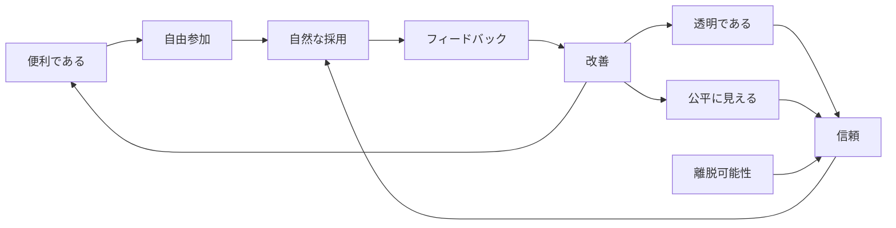

# 非強制的な導入

この図は、[設計原則](../../docs/ja/01-principles.md) の「強制ではなく利便性」を、[ロードマップ](../../docs/ja/03-roadmap.md) 上の普及モデルとして表したものです。便利さが実質的強制へ変わるリスクは [脅威モデル](../../docs/ja/05-threat-model.md) で確認します。

```mermaid
flowchart LR
  Useful["便利である"]
  Transparent["透明である"]
  Fair["公平に見える"]
  Voluntary["自由参加"]
  Trust["信頼"]
  Adoption["自然な採用"]
  Exit["離脱可能性"]
  Feedback["フィードバック"]
  Improvement["改善"]

  Useful --> Voluntary
  Transparent --> Trust
  Fair --> Trust
  Voluntary --> Adoption
  Trust --> Adoption
  Adoption --> Feedback
  Exit --> Trust
  Feedback --> Improvement
  Improvement --> Useful
  Improvement --> Transparent
  Improvement --> Fair

  click Useful "https://github.com/acecore-systems/world-foundation/blob/main/docs/ja/01-principles.md" "強制ではなく利便性"
  click Transparent "https://github.com/acecore-systems/world-foundation/blob/main/modules/ja/audit/README.md" "透明性"
  click Fair "https://github.com/acecore-systems/world-foundation/blob/main/modules/ja/governance/README.md" "公平性"
  click Voluntary "https://github.com/acecore-systems/world-foundation/blob/main/docs/ja/01-principles.md" "設計原則"
  click Trust "https://github.com/acecore-systems/world-foundation/blob/main/modules/ja/reputation/README.md" "信頼"
  click Exit "https://github.com/acecore-systems/world-foundation/blob/main/docs/ja/01-principles.md" "離脱可能性"
  click Adoption "https://github.com/acecore-systems/world-foundation/blob/main/docs/ja/03-roadmap.md" "ロードマップ"
  click Feedback "https://github.com/acecore-systems/world-foundation/blob/main/docs/ja/05-threat-model.md" "脅威モデル"
  click Improvement "https://github.com/acecore-systems/world-foundation/blob/main/proposals/ja/README.md" "改善提案"
```
