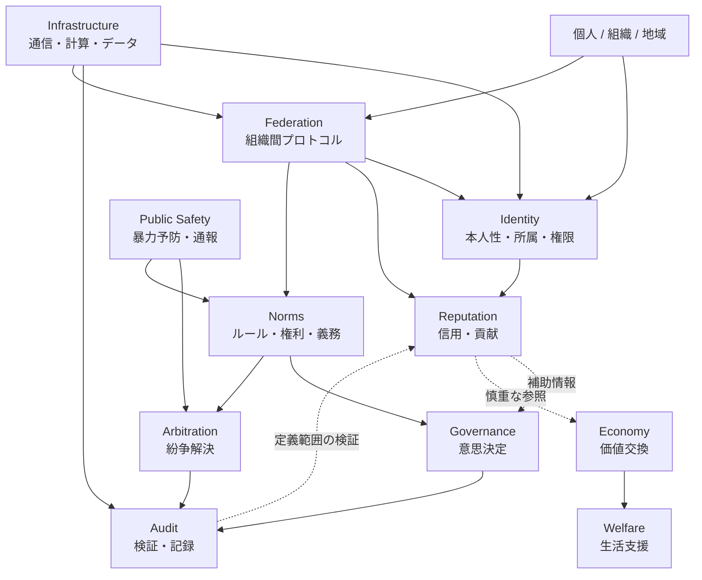

# Expanded Module Relationships

この図は、[Architecture](../../docs/ja/02-architecture.md) の拡張後モジュール、特に [Norms](../../modules/ja/norms/README.md)、[Public Safety](../../modules/ja/public-safety/README.md)、[Federation](../../modules/ja/federation/README.md) を含む関係を示します。

矢印は支配関係ではなく、参照・連携・検証・相互接続を示します。中央支配化や自警団化などのリスクは [Threat Model](../../docs/ja/05-threat-model.md) へ戻して確認します。

