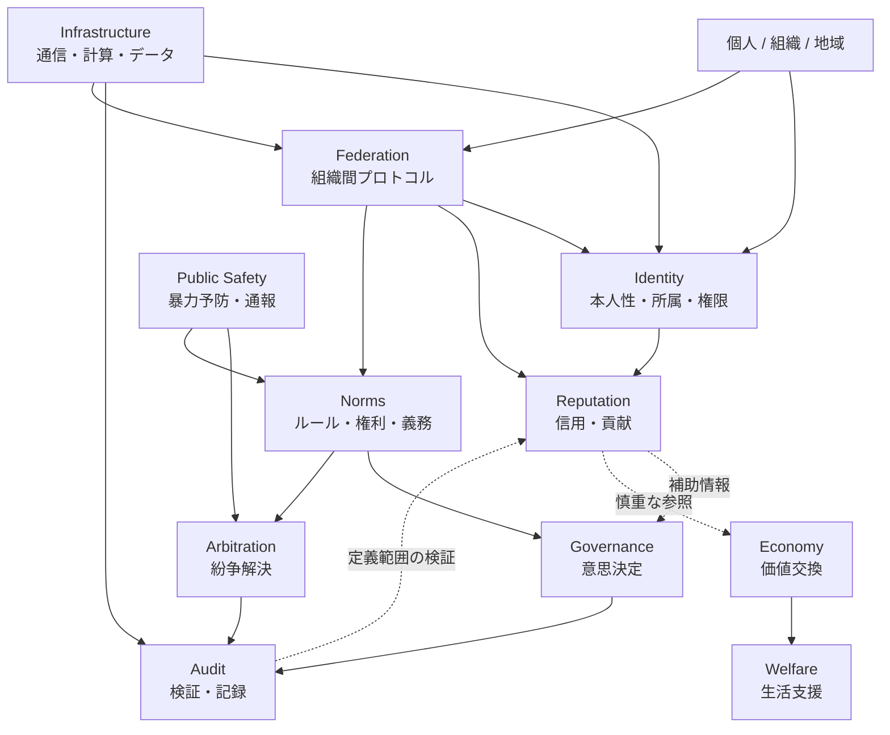

# Expanded Module Relationships

この図は、Norms、Public Safety、Federationを含む拡張後のモジュール関係を示します。

矢印は支配関係ではなく、参照・連携・検証・相互接続を示します。

```mermaid
flowchart TB
  People["個人 / 組織 / 地域"]
  Federation["Federation<br/>組織間プロトコル"]
  Identity["Identity<br/>本人性・所属・権限"]
  Reputation["Reputation<br/>信用・貢献"]
  Norms["Norms<br/>ルール・権利・義務"]
  Governance["Governance<br/>意思決定"]
  Arbitration["Arbitration<br/>紛争解決"]
  PublicSafety["Public Safety<br/>暴力予防・通報"]
  Economy["Economy<br/>価値交換"]
  Welfare["Welfare<br/>生活支援"]
  Infrastructure["Infrastructure<br/>通信・計算・データ"]
  Audit["Audit<br/>検証・記録"]

  People --> Identity
  People --> Federation
  Federation --> Identity
  Federation --> Reputation
  Federation --> Norms
  Identity --> Reputation
  Norms --> Governance
  Norms --> Arbitration
  Governance --> Audit
  Arbitration --> Audit
  PublicSafety --> Arbitration
  PublicSafety --> Norms
  Economy --> Welfare
  Reputation -. "補助情報" .-> Governance
  Reputation -. "慎重な参照" .-> Economy
  Audit -. "定義範囲の検証" .-> Reputation
  Infrastructure --> Identity
  Infrastructure --> Audit
  Infrastructure --> Federation
```
