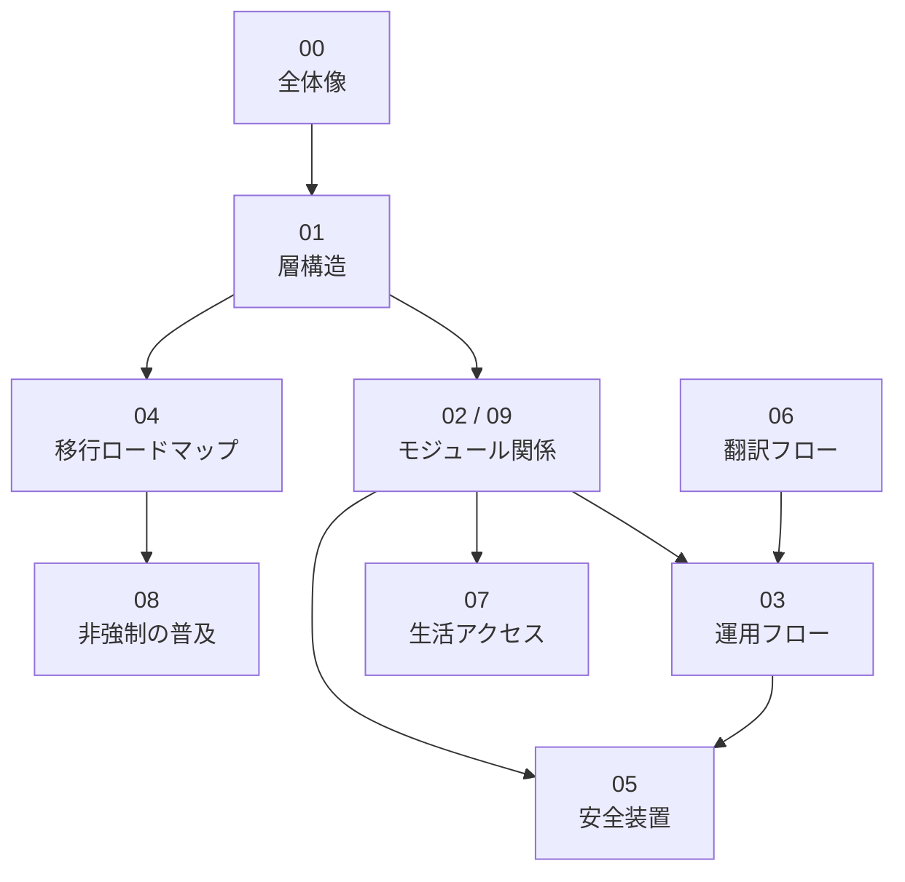

# 図表

このディレクトリには、World Foundation Designの構造、モジュール関係、ガバナンスフロー、移行ロードマップなどを説明する図表を置きます。

図表は、設計文書、モジュール、運用記録、調査への参照索引として扱います。図だけで完結させず、説明文や図のノードから本文へ戻れるようにします。

## ビジュアルリンクマップ

Mermaidが見づらい場合の入口として、クリック可能なSVG索引も置きます。

SVG内の各ノードは、主要な設計文書、モジュール索引、提案、意思決定、用語集へリンクします。GitHub上で画像としてだけ見える場合は、[SVGファイル](visual-link-map.svg) を直接開いて使います。

## 索引構成

## 図表一覧

| 図 | 役割 | 主な詳細文書 |
| --- | --- | --- |
| [世界設計の全体像](00-world-design-overview.md) | 世界設計の全体像 | [ビジョン](../../docs/ja/00-vision.md), [設計原則](../../docs/ja/01-principles.md), [ビジュアルリンクマップ](visual-link-map.svg) |
| [協力基盤の層構造](01-cooperation-foundation-layers.md) | 協力基盤の層構造 | [アーキテクチャ](../../docs/ja/02-architecture.md), [モジュール](../../modules/ja/README.md), [拡張モジュール関係図](09-expanded-module-map.md) |
| [モジュール関係図](02-module-relationships.md) | モジュール関係図 | [モジュール](../../modules/ja/README.md), [アーキテクチャ](../../docs/ja/02-architecture.md), [脅威モデル](../../docs/ja/05-threat-model.md) |
| [ガバナンスプロセス](03-governance-process.md) | Issueから意思決定までの流れ | [提案](../../proposals/ja/README.md), [意思決定](../../decisions/ja/README.md), [ガバナンスモジュール](../../modules/ja/governance/README.md) |
| [移行ロードマップ](04-transition-roadmap.md) | 既存制度から協力基盤への段階的移行 | [ロードマップ](../../docs/ja/03-roadmap.md), [非強制の普及モデル](08-non-coercive-adoption.md), [調査](../../research/ja/README.md) |
| [リスクと安全性のループ](05-risk-and-safety-loops.md) | 腐敗耐性と安全装置 | [脅威モデル](../../docs/ja/05-threat-model.md), [対象外](../../docs/ja/04-non-goals.md), [安全方針](../../SAFETY.md) |
| [多言語ドキュメント運用](06-multilingual-document-flow.md) | 日本語正本と翻訳の管理フロー | [翻訳ステータス](../../docs/ja/07-translation-status.md), [英語版文書](../../docs/en/README.md), [用語集](../../glossary/README.md) |
| [生活アクセスモデル](07-life-access-model.md) | 生活アクセスの設計モデル | [生活アクセスの持続可能性](../../docs/ja/06-life-access-sustainability.md), [福祉モジュール](../../modules/ja/welfare/README.md), [経済モジュール](../../modules/ja/economy/README.md) |
| [非強制の普及モデル](08-non-coercive-adoption.md) | 非強制の普及モデル | [設計原則](../../docs/ja/01-principles.md), [ビジョン](../../docs/ja/00-vision.md), [移行ロードマップ](04-transition-roadmap.md) |
| [拡張モジュール関係図](09-expanded-module-map.md) | 規範 / 公共安全 / 連合を含む拡張モジュール関係図 | [アーキテクチャ](../../docs/ja/02-architecture.md), [モジュール](../../modules/ja/README.md), [モジュール関係図](02-module-relationships.md) |

## 表現形式の検討

Mermaidは、GitHub上で表示でき、差分レビューしやすい初期形式として使います。ただし、読みやすい公開図、クリック可能な索引、議論用の手描き図までMermaidだけで済ませません。図の目的に応じて、次の形式を使い分けます。

| 形式 | 使う場面 | このリポジトリでの扱い |
| --- | --- | --- |
| Mermaid | フロー、関係図、レビュー中の設計メモ | Markdown内の軽量な図として使う。見た目を詰めすぎない |
| SVG | 主要な全体図、クリック可能な索引、公開向けの清書 | Markdown図が読みにくい場合の代替入口にする |
| Excalidraw | 構想段階の手描き風整理、議論中の概念図 | 議論用。採用する場合は `.excalidraw` と書き出し画像をセットで置く |
| diagrams.net / draw.io | 複雑な構造図、公開資料用の清書 | XML差分が大きいため、更新理由と書き出し先を明記する |
| D2 / Graphviz | 大きな依存関係、モジュール間関係の自動レイアウト | 生成手順を残せる場合に採用する |
| Markdown table | 図と本文の対応表、読み順、責任範囲 | リンクの正本として扱う。図だけではなく表でも辿れるようにする |

当面は、Markdownページを正本にし、Mermaidはその中の図表現として扱います。中心となる図はSVGやExcalidrawなどを併用できます。併用する場合は、正本ファイル、書き出しファイル、更新手順を同じディレクトリ内に明記します。

## リンク方針

リンクは、独立したリンク一覧として積み上げるのではなく、できる限り説明文、表、Mermaidの `click`、SVGノードの中へ埋め込みます。

図と本文のどちらから読んでも同じ設計判断へ戻れるようにします。Mermaidを使う場合も、単なる挿絵にせず、ノードを対応する本文、図表、[Issue](https://github.com/acecore-systems/world-foundation/issues)、[Pull Request](https://github.com/acecore-systems/world-foundation/pulls) へ接続します。リンク集は索引ページや表が必要な場合だけにします。

## 方針

現時点の図表は、レビューしやすいMermaid入りMarkdownを中心に管理します。ただし、Mermaidが読みづらい場面ではSVG索引やMarkdown表を優先して補います。

図は完成図ではなく、議論のための設計メモです。構造が変わった場合は、対応するdocs、modules、glossary、提案、意思決定と一緒に更新します。Mermaid以外の形式を採用する場合も、変更理由と更新手順を残します。
