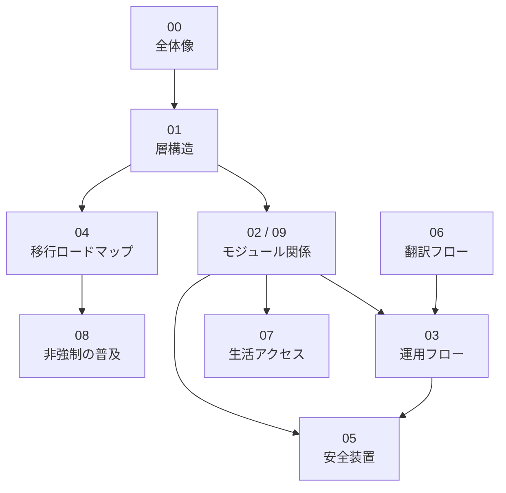

# Diagrams

このディレクトリには、World Foundation Designの構造、モジュール関係、ガバナンスフロー、移行ロードマップなどを説明する図表を置きます。

図表は、設計文書、モジュール、運用記録、調査への参照索引として扱います。

## 索引構成

## 図表一覧

| 図 | 役割 | 主な詳細文書 |
| --- | --- | --- |
| [00-world-design-overview.md](00-world-design-overview.md) | 世界設計の全体像 | [00-vision.md](../../docs/ja/00-vision.md) |
| [01-cooperation-foundation-layers.md](01-cooperation-foundation-layers.md) | 協力基盤の層構造 | [02-architecture.md](../../docs/ja/02-architecture.md) |
| [02-module-relationships.md](02-module-relationships.md) | モジュール関係図 | [modules/ja](../../modules/ja/README.md) |
| [03-governance-process.md](03-governance-process.md) | IssueからDecisionまでの流れ | [proposals/ja](../../proposals/ja/README.md), [decisions/ja](../../decisions/ja/README.md) |
| [04-transition-roadmap.md](04-transition-roadmap.md) | 既存制度から協力基盤への段階的移行 | [03-roadmap.md](../../docs/ja/03-roadmap.md) |
| [05-risk-and-safety-loops.md](05-risk-and-safety-loops.md) | 腐敗耐性と安全装置 | [05-threat-model.md](../../docs/ja/05-threat-model.md), [SAFETY.md](../../SAFETY.md) |
| [06-multilingual-document-flow.md](06-multilingual-document-flow.md) | 日本語正本と翻訳の管理フロー | [07-translation-status.md](../../docs/ja/07-translation-status.md) |
| [07-life-access-model.md](07-life-access-model.md) | 生活アクセスの設計モデル | [06-life-access-sustainability.md](../../docs/ja/06-life-access-sustainability.md) |
| [08-non-coercive-adoption.md](08-non-coercive-adoption.md) | 非強制の普及モデル | [01-principles.md](../../docs/ja/01-principles.md) |
| [09-expanded-module-map.md](09-expanded-module-map.md) | Norms / Public Safety / Federationを含む拡張モジュール関係図 | [02-architecture.md](../../docs/ja/02-architecture.md), [modules/ja](../../modules/ja/README.md) |

## 表現形式の検討

Mermaidは、GitHub上で表示でき、差分レビューしやすい初期形式として使います。ただし、すべての図をMermaidに固定しません。図の目的に応じて、次の形式も検討対象にします。

| 形式 | 向いている用途 | 注意点 |
| --- | --- | --- |
| Mermaid | フロー、関係図、初期設計メモ | レイアウトや視覚表現の細かい制御は弱い |
| SVG | 主要な全体図、クリック可能な索引、公開用の図 | 手編集の差分が読みづらくなりやすい |
| Excalidraw | 構想段階の手描き風整理、議論中の概念図 | ソースと書き出し画像の同期ルールが必要 |
| diagrams.net / draw.io | 複雑な構造図、公開向けの清書 | XML差分が大きくなりやすい |
| D2 / Graphviz | 自動レイアウトが必要な関係図 | 表示や生成に追加ツールが必要 |
| HTML / SVG index | 詳細文書へ直接移動できるインタラクティブな索引 | 静的Markdownだけでは完結しにくい |

当面は、レビューしやすいMermaidを正本にしつつ、中心となる図はSVGやExcalidrawなどの併用を検討します。併用する場合は、正本ファイル、書き出しファイル、更新手順を同じディレクトリ内に明記します。

## 方針

現時点の図表は、レビューしやすいMermaid入りMarkdownを中心に管理します。

図は完成図ではなく、議論のための設計メモです。構造が変わった場合は、対応するdocs、modules、glossary、Proposal、Decisionと一緒に更新します。Mermaid以外の形式を採用する場合も、変更理由と更新手順を残します。
