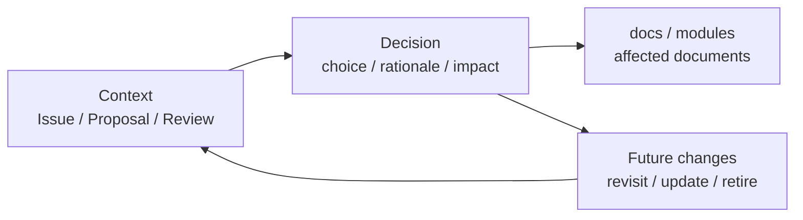

# Decisions

This directory records important design decisions and their rationale.

## Position

## Scope

- Important design policies
- Accepted architecture choices
- Rejected alternatives and rationale
- Governance decisions
- Definitions that affect terms or principles

Early decisions may be written only in Japanese. Important decisions can be translated later.
