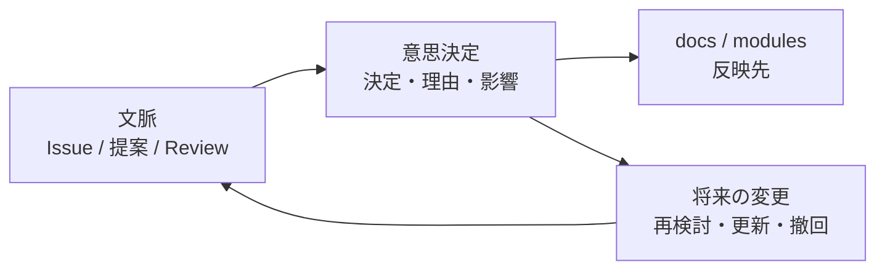

# 意思決定

このディレクトリには、重要な意思決定の記録を置きます。

意思決定は、何を決めたかだけでなく、なぜその判断をしたのかを残すために使います。通常は [提案](../../proposals/ja/README.md) やレビュー文脈から生まれ、採用後は [docs/ja](../../docs/ja/README.md)、[modules/ja](../../modules/ja/README.md)、[glossary](../../glossary/README.md) に反映します。

## 位置づけ

## 書くべきもの

- 重要な設計方針
- 採用したアーキテクチャ
- 却下した案と理由
- ガバナンス上の判断
- 用語や思想の定義

## 命名

初期は `0001-short-title.md` のような連番形式を推奨します。

意思決定は将来の参加者が背景を追えるよう、結論だけでなく文脈、理由、影響も書きます。

## 意思決定一覧

- [0001-japanese-first-policy.md](0001-japanese-first-policy.md): 日本語ファースト方針
- [0002-single-glossary-yaml.md](0002-single-glossary-yaml.md): 用語集を単一YAMLで管理する
- [0003-lightweight-governance-process.md](0003-lightweight-governance-process.md): 初期は軽量ガバナンスで運用する
- [0004-founder-non-privilege-and-exit-policy.md](0004-founder-non-privilege-and-exit-policy.md): 創設者非特権と退出方針
