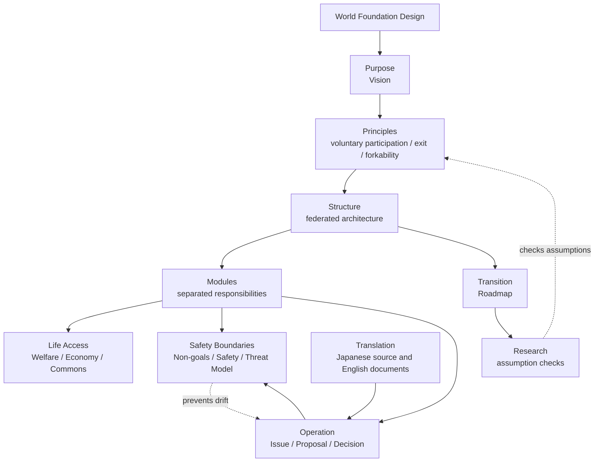

# World Foundation Design Documents

This directory contains the core design documents for World Foundation Design.

The Japanese documents in `docs/ja/` are the initial source of truth. English documents are prepared so international collaboration can grow over time.

## Design Structure

The core design connects purpose, principles, structure, modules, safety boundaries, operations, transition, and research.

## Detail Paths

| Area | Start here | More detail |
| --- | --- | --- |
| Purpose | [00-vision.md](00-vision.md) | [00-world-design-overview.md](../../assets/diagrams/00-world-design-overview.md) |
| Principles | [01-principles.md](01-principles.md) | [08-non-coercive-adoption.md](../../assets/diagrams/08-non-coercive-adoption.md) |
| Structure | [02-architecture.md](02-architecture.md) | [01-cooperation-foundation-layers.md](../../assets/diagrams/01-cooperation-foundation-layers.md) |
| Modules | [modules/en](../../modules/en/README.md) | [02-module-relationships.md](../../assets/diagrams/02-module-relationships.md), [09-expanded-module-map.md](../../assets/diagrams/09-expanded-module-map.md) |
| Safety Boundaries | [04-non-goals.md](04-non-goals.md), [05-threat-model.md](05-threat-model.md) | [SAFETY.md](../../SAFETY.md), [05-risk-and-safety-loops.md](../../assets/diagrams/05-risk-and-safety-loops.md) |
| Operation | [proposals/en](../../proposals/en/README.md), [decisions/en](../../decisions/en/README.md) | [03-governance-process.md](../../assets/diagrams/03-governance-process.md), [governance module](../../modules/en/governance/README.md) |
| Transition | [03-roadmap.md](03-roadmap.md) | [04-transition-roadmap.md](../../assets/diagrams/04-transition-roadmap.md) |
| Life Access | [06-life-access-sustainability.md](06-life-access-sustainability.md) | [07-life-access-model.md](../../assets/diagrams/07-life-access-model.md), [welfare module](../../modules/en/welfare/README.md), [economy module](../../modules/en/economy/README.md) |
| Translation | [07-translation-status.md](07-translation-status.md) | [06-multilingual-document-flow.md](../../assets/diagrams/06-multilingual-document-flow.md), [glossary](../../glossary/README.md) |
| Research | [research/en/index.md](../../research/en/index.md) | [research/en](../../research/en/README.md) |

## Related Diagrams

- [00-world-design-overview.md](../../assets/diagrams/00-world-design-overview.md): World design overview
- [01-cooperation-foundation-layers.md](../../assets/diagrams/01-cooperation-foundation-layers.md): Cooperation foundation layers
- [02-module-relationships.md](../../assets/diagrams/02-module-relationships.md): Module relationships
- [03-governance-process.md](../../assets/diagrams/03-governance-process.md): Governance process from Issue to Decision
- [04-transition-roadmap.md](../../assets/diagrams/04-transition-roadmap.md): Transition roadmap
- [05-risk-and-safety-loops.md](../../assets/diagrams/05-risk-and-safety-loops.md): Risk and safety loops
- [06-multilingual-document-flow.md](../../assets/diagrams/06-multilingual-document-flow.md): Multilingual document flow
- [07-life-access-model.md](../../assets/diagrams/07-life-access-model.md): Life access model
- [08-non-coercive-adoption.md](../../assets/diagrams/08-non-coercive-adoption.md): Non-coercive adoption model
- [09-expanded-module-map.md](../../assets/diagrams/09-expanded-module-map.md): Expanded module relationships

## Documents

- `00-vision.md`: Vision
- `01-principles.md`: Design principles
- `02-architecture.md`: Architecture
- `03-roadmap.md`: Roadmap
- `04-non-goals.md`: What this design does not aim to do
- `05-threat-model.md`: Risks such as corruption, domination, misuse, legal conflict, and surveillance
- `06-life-access-sustainability.md`: Life access and resource allocation sustainability
- `07-translation-status.md`: Translation status policy

## Translation Policy

The English documents are intentionally concise at this stage. They should preserve the intent of the Japanese source documents and avoid language that makes this design look like a ruling authority, closed community, or coercive movement.

Important proposals and decisions can be translated later when they become relevant to international collaboration.
