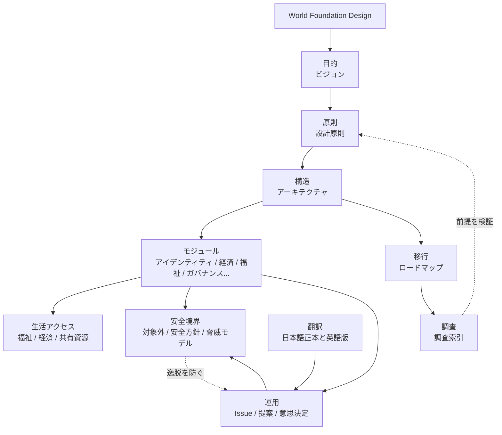

# World Foundation設計文書

このディレクトリには、理想的な世界の基本設計文書を配置します。

日本語版は初期の正本として扱います。英語版は `docs/en/` に置き、重要な文書から順に翻訳・更新します。

## 全体構成

基本設計は、目的、原則、構造、モジュール、安全境界、運用、移行、調査を相互に接続して扱います。

図から読みたい場合は、クリック可能な [ビジュアルリンクマップ](../../assets/diagrams/visual-link-map.svg) または各項目の「さらに見る」から入れます。

## 詳細への導線

| 項目 | まず読む | さらに見る |
| --- | --- | --- |
| 目的 | [00-vision.md](00-vision.md) | [00-world-design-overview.md](../../assets/diagrams/00-world-design-overview.md), [ビジュアルリンクマップ](../../assets/diagrams/visual-link-map.svg) |
| 原則 | [01-principles.md](01-principles.md) | [08-non-coercive-adoption.md](../../assets/diagrams/08-non-coercive-adoption.md), [04-non-goals.md](04-non-goals.md) |
| 構造 | [02-architecture.md](02-architecture.md) | [01-cooperation-foundation-layers.md](../../assets/diagrams/01-cooperation-foundation-layers.md), [modules/ja](../../modules/ja/README.md) |
| モジュール | [modules/ja](../../modules/ja/README.md) | [02-module-relationships.md](../../assets/diagrams/02-module-relationships.md), [09-expanded-module-map.md](../../assets/diagrams/09-expanded-module-map.md), [05-threat-model.md](05-threat-model.md) |
| 安全境界 | [04-non-goals.md](04-non-goals.md), [05-threat-model.md](05-threat-model.md) | [安全方針](../../SAFETY.md), [05-risk-and-safety-loops.md](../../assets/diagrams/05-risk-and-safety-loops.md) |
| 運用 | [proposals/ja](../../proposals/ja/README.md), [decisions/ja](../../decisions/ja/README.md) | [03-governance-process.md](../../assets/diagrams/03-governance-process.md), [ガバナンスモジュール](../../modules/ja/governance/README.md) |
| 移行 | [03-roadmap.md](03-roadmap.md) | [04-transition-roadmap.md](../../assets/diagrams/04-transition-roadmap.md), [08-non-coercive-adoption.md](../../assets/diagrams/08-non-coercive-adoption.md) |
| 生活アクセス | [06-life-access-sustainability.md](06-life-access-sustainability.md) | [07-life-access-model.md](../../assets/diagrams/07-life-access-model.md), [福祉モジュール](../../modules/ja/welfare/README.md), [経済モジュール](../../modules/ja/economy/README.md), [05-threat-model.md](05-threat-model.md) |
| 翻訳 | [07-translation-status.md](07-translation-status.md) | [06-multilingual-document-flow.md](../../assets/diagrams/06-multilingual-document-flow.md), [用語集](../../glossary/README.md), [英語版文書](../en/README.md) |
| 調査 | [research/ja/index.md](../../research/ja/index.md) | [research/ja](../../research/ja/README.md) |

## 文書一覧

- `00-vision.md`: 目指す世界
- `01-principles.md`: 設計原則
- `02-architecture.md`: 全体アーキテクチャ
- `03-roadmap.md`: 段階的な移行計画
- `04-non-goals.md`: この設計が目指さないもの
- `05-threat-model.md`: 腐敗、支配、悪用、法務衝突、監視化などのリスク整理
- `06-life-access-sustainability.md`: 生活アクセスと資源配分の持続可能性
- `07-translation-status.md`: 日本語正本と翻訳ステータス管理
