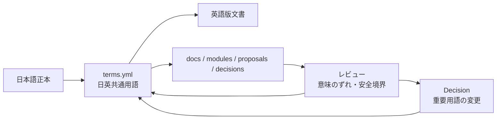

# Glossary

このディレクトリには、World Foundation Designで使う重要用語を置きます。

用語集は、思想や設計の一貫性を保つための共通辞書です。日本語と英語を同じYAMLファイルで管理し、翻訳や議論のずれを減らします。翻訳状態は [Translation Status](../docs/ja/07-translation-status.md)、日英の流れは [Multilingual Document Flow](../assets/diagrams/06-multilingual-document-flow.md)、単一YAML方針は [Decision 0002](../decisions/ja/0002-single-glossary-yaml.md) にあります。

## 用語の位置づけ



## 方針

- `terms.yml` に全言語の用語をまとめる
- 用語の追加・変更はPull Requestでレビューする
- 支配、強制、過度な対立、一元的な統制主体のように見える表現を避ける
- 重要な用語変更は必要に応じて `decisions/` に記録する
- 用語追加時は重複IDを作らない
- 重要用語には `description` を必ず付ける
- 用語変更が思想や安全境界に影響する場合はDecisionへ記録する
- 翻訳が不確かな場合はTranslation Issueを作る

## 用語形式

```yaml
- id: life_os
  ja: 生活OS
  en: Life OS
  description:
    ja: 人間の生活基盤を抽象化し、統合するための協力基盤。
    en: A cooperation infrastructure that abstracts and integrates the foundations of human life.
```
