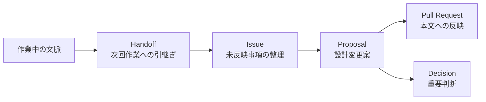

# Handoffs

このディレクトリには、次の作業者や次回Codexへ渡すための引継ぎ記録を置きます。

引継ぎ書は設計本文ではありません。設計に反映する場合は、Issue、Proposal、Pull Request、Decisionの流れで扱います。

## 位置づけ

```mermaid
flowchart LR
  Work["作業中の文脈"]
  Handoff["Handoff<br/>次回作業への引継ぎ"]
  Issue["Issue<br/>未反映事項の整理"]
  Proposal["Proposal<br/>設計変更案"]
  PullRequest["Pull Request<br/>本文への反映"]
  Decision["Decision<br/>重要判断"]

  Work --> Handoff
  Handoff --> Issue
  Issue --> Proposal
  Proposal --> PullRequest
  Proposal --> Decision
```
