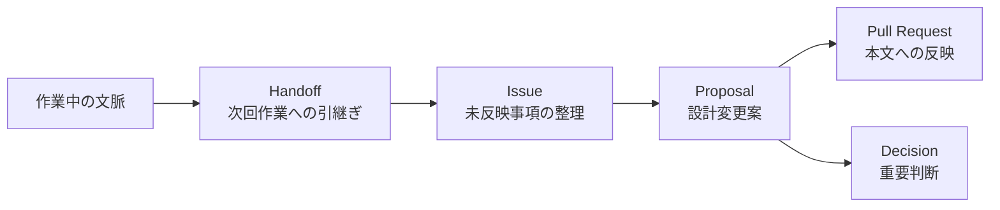

# Handoffs

このディレクトリには、次の作業者や次回Codexへ渡すための引継ぎ記録を置きます。

引継ぎ書は設計本文ではありません。設計に反映する場合は、[Issue](https://github.com/acecore-systems/world-foundation/issues)、[Proposal](../../proposals/ja/README.md)、[Pull Request](https://github.com/acecore-systems/world-foundation/pulls)、[Decision](../../decisions/ja/README.md) の流れで扱います。

## 位置づけ

