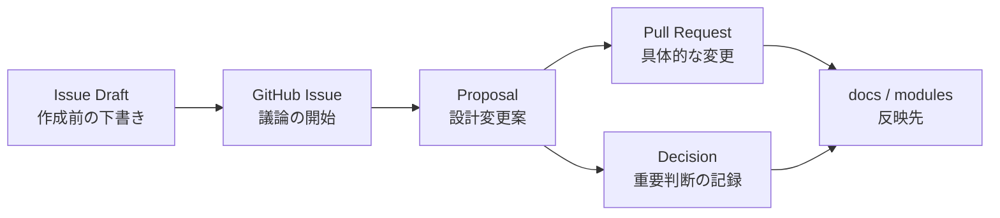

# Issue Drafts

このディレクトリには、GitHub Issueとして作成する前の下書きを置きます。

Issue下書きは正式な設計決定ではありません。実際に採用する場合は、Issue、Proposal、Pull Request、Decisionの流れで扱います。

## 位置づけ

```mermaid
flowchart LR
  Draft["Issue Draft<br/>作成前の下書き"]
  Issue["GitHub Issue<br/>議論の開始"]
  Proposal["Proposal<br/>設計変更案"]
  PullRequest["Pull Request<br/>具体的な変更"]
  Decision["Decision<br/>重要判断の記録"]
  Docs["docs / modules<br/>反映先"]

  Draft --> Issue
  Issue --> Proposal
  Proposal --> PullRequest
  PullRequest --> Docs
  Proposal --> Decision
  Decision --> Docs
```
