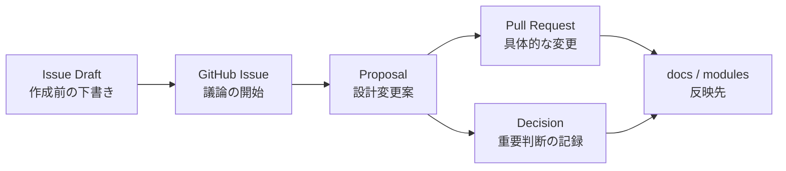

# Issue Drafts

このディレクトリには、[GitHub Issue](https://github.com/acecore-systems/world-foundation/issues) として作成する前の下書きを置きます。

Issue下書きは正式な設計決定ではありません。実際に採用する場合は、[Issue](https://github.com/acecore-systems/world-foundation/issues)、[Proposal](../../proposals/ja/README.md)、[Pull Request](https://github.com/acecore-systems/world-foundation/pulls)、[Decision](../../decisions/ja/README.md) の流れで扱います。

## 位置づけ

