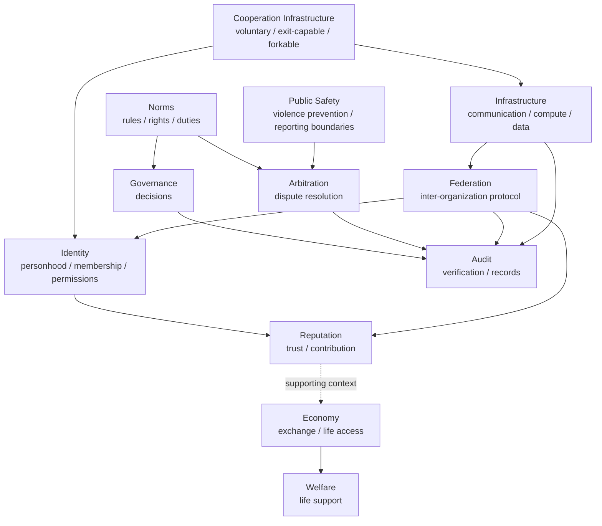

# Modules

This directory contains design notes for the functional modules of World Foundation Design.

Modules are not units of control. They separate responsibilities so each area can connect with others without taking over their scope.

## Module Index

## Module List

| Module | Role |
| --- | --- |
| [identity/README.md](identity/README.md) | Personhood, membership, and permissions |
| [reputation/README.md](reputation/README.md) | Trust, contribution, and context-specific evaluation |
| [economy/README.md](economy/README.md) | Exchange, internal records, and life access |
| [welfare/README.md](welfare/README.md) | Life support that reduces survival anxiety |
| [governance/README.md](governance/README.md) | Decisions, change processes, and authority management |
| [arbitration/README.md](arbitration/README.md) | Dispute resolution and appeals |
| [infrastructure/README.md](infrastructure/README.md) | Communication, computation, data, and life infrastructure |
| [audit/README.md](audit/README.md) | Verification, records, and public/protected information boundaries |
| [norms/README.md](norms/README.md) | Rules, terms, rights, and duties |
| [public-safety/README.md](public-safety/README.md) | Violence prevention, reporting, and public safety boundaries |
| [federation/README.md](federation/README.md) | Inter-organization protocols, autonomy, and interoperability |

## Related Diagrams

- [02-module-relationships.md](../../assets/diagrams/02-module-relationships.md): Module relationships
- [09-expanded-module-map.md](../../assets/diagrams/09-expanded-module-map.md): Expanded module relationships
- [01-cooperation-foundation-layers.md](../../assets/diagrams/01-cooperation-foundation-layers.md): Cooperation foundation layers
