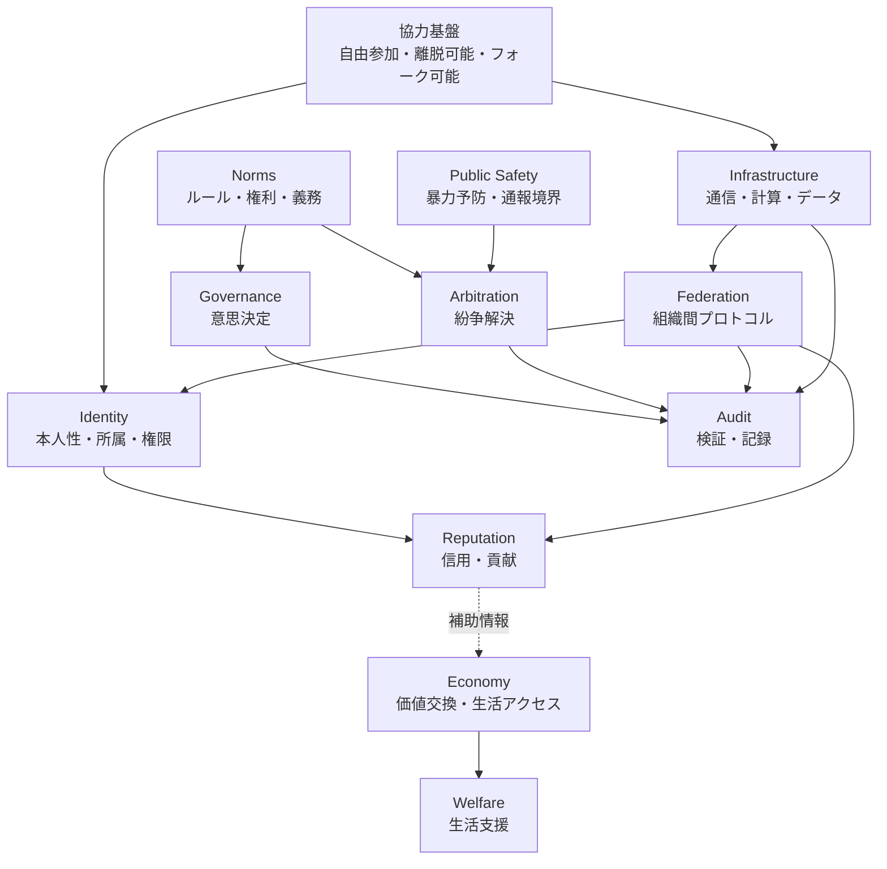

# Modules

このディレクトリには、World Foundation Designを構成する機能モジュールの設計メモを置きます。

モジュールは支配単位ではなく、責任範囲を分けるための単位です。各モジュールは接続しますが、他モジュールの責任を侵食しないように設計します。

## モジュール構成

## モジュール一覧

| モジュール | 役割 |
| --- | --- |
| [identity/README.md](identity/README.md) | 本人性、所属、権限 |
| [reputation/README.md](reputation/README.md) | 信用、貢献、文脈別評価 |
| [economy/README.md](economy/README.md) | 価値交換、内部記録、生活アクセス |
| [welfare/README.md](welfare/README.md) | 生存不安を減らす生活支援 |
| [governance/README.md](governance/README.md) | 意思決定、変更手続き、権限管理 |
| [arbitration/README.md](arbitration/README.md) | 紛争解決、異議申し立て |
| [infrastructure/README.md](infrastructure/README.md) | 通信、計算、データ、生活基盤 |
| [audit/README.md](audit/README.md) | 検証、記録、公開情報と保護情報の境界 |
| [norms/README.md](norms/README.md) | ルール、規約、権利、義務 |
| [public-safety/README.md](public-safety/README.md) | 暴力予防、通報、公共安全境界 |
| [federation/README.md](federation/README.md) | 組織間プロトコル、自治、相互運用性 |

## 関連図表

- [02-module-relationships.md](../../assets/diagrams/02-module-relationships.md): モジュール関係図
- [09-expanded-module-map.md](../../assets/diagrams/09-expanded-module-map.md): 拡張モジュール関係図
- [01-cooperation-foundation-layers.md](../../assets/diagrams/01-cooperation-foundation-layers.md): 協力基盤の層構造
