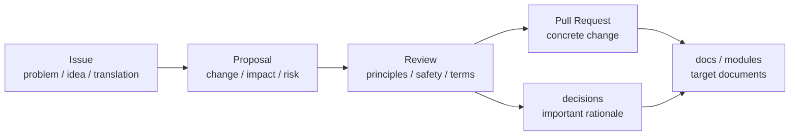

# Proposals

This directory contains design proposals for World Foundation Design.

Proposals are used before changing core documents or modules.

## Position

## Scope

- Design changes
- New modules or operating procedures
- Policy changes that affect core documents
- Risks, alternatives, and affected documents
- Impact on docs, modules, glossary, or decisions

Early proposals may be written only in Japanese. Important accepted proposals can be translated later.
