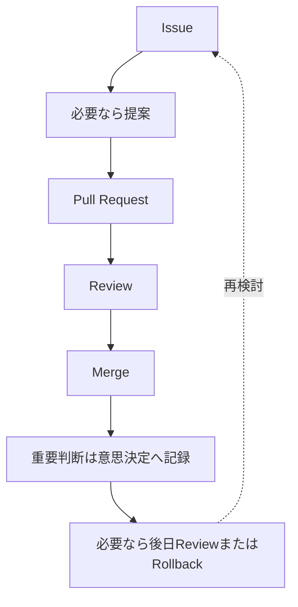

# 提案: 初期ガバナンスプロセス

## 概要

World Foundation Designの初期運営では、[Issue](https://github.com/acecore-systems/world-foundation/issues)、[提案](README.md)、[Pull Request](https://github.com/acecore-systems/world-foundation/pulls)、Review、Merge、[意思決定](../../decisions/ja/README.md)、必要に応じたReviewまたはRollbackを使った軽量なガバナンスプロセスを採用する。

初期段階では参加者数が少ないため、過剰な投票制度や複雑な承認フローは導入しない。ただし、重要な判断理由は記録し、後から検証・改善・フォークできる状態を保つ。

## 問題

このリポジトリは社会設計リポジトリであり、単なる文章置き場ではない。

思想、用語、原則、モジュール責任、移行方針などの変更は、後の設計全体に影響する。その一方で、初期から複雑な制度を入れすぎると、参加者が提案しづらくなり、議論速度が落ちる。

必要なのは、初期参加者が迷わず使える軽量な手続きと、重要な判断を失わない記録方法である。

## 動機

この提案は、次の目的を持つ。

- 変更の入口を明確にする
- 重要な判断理由を残す
- レビュー可能な形で設計を進める
- 権限集中や密室判断を避ける
- 将来のメンテナー制度、投票制度、意思決定 Processへ拡張しやすくする

## 提案する変更

初期ガバナンスプロセスとして、次の運用を採用する。

## 変更の種類

### 1. 軽微な変更

誤字修正、リンク修正、表現の明確化、構造を変えない補足などは、[Pull Request](https://github.com/acecore-systems/world-foundation/pulls) で直接提案できる。

### 2. 通常の設計変更

[設計文書](../../docs/ja/README.md)、[モジュール](../../modules/ja/README.md)、[用語集](../../glossary/README.md)、[調査](../../research/ja/README.md) の内容を変更する場合は、[Pull Request](https://github.com/acecore-systems/world-foundation/pulls) で提案し、レビューで理由と影響を確認する。

### 3. 重要な設計変更

以下に関わる変更は、原則として提案を作成する。

- ビジョン
- 設計原則
- アーキテクチャ
- モジュール責任範囲
- 用語集の重要用語
- 対象外
- 安全方針
- 脅威モデル
- ガバナンス Process
- 経済や福祉の運用原則
- 離脱可能性、フォーク可能性、透明性に影響する変更

### 4. 意思決定の記録

重要な提案を採用、却下、保留、または置き換える場合は、意思決定として記録する。

意思決定には、結論だけでなく、背景、理由、代替案、影響を残す。

## Issueの使い分け

- Idea: 新しいアイデア
- Problem: 問題、矛盾、リスク
- 提案: 設計変更の提案
- 翻訳: 翻訳、用語、多言語対応

[Issue](https://github.com/acecore-systems/world-foundation/issues) は必ずしも完成された提案である必要はない。違和感、懸念、未整理の問いも歓迎する。

## Pull Requestの使い方

[Pull Request](https://github.com/acecore-systems/world-foundation/pulls) では、次の観点を確認する。

- 特定名称や組織を一元的な統制主体のように見せていないか
- 自由参加、離脱可能性、透明性に反していないか
- 用語集と矛盾していないか
- 悪用ケースや腐敗リスクを検討したか
- 支配、強制、違法回避、カルト化、監視強化、離脱不能性につながっていないか
- 対象外、安全方針、脅威モデルへの影響を確認したか
- 重大なリスクがある場合、脅威モデルを更新したか
- 後から問題が出た場合のRollback Planを確認したか
- 日本語正本と英語版の関係を壊していないか
- 翻訳に影響する場合、[翻訳 Issue](https://github.com/acecore-systems/world-foundation/issues) を作る必要があるか
- 重要な判断が意思決定として残されるべきか

## 初期メンテナーの役割

初期メンテナーは、支配的な権限者ではなく、リポジトリの品質と議論の流れを維持する責任を持つ。

主な役割は次の通り。

- [Issue](https://github.com/acecore-systems/world-foundation/issues) と [Pull Request](https://github.com/acecore-systems/world-foundation/pulls) の整理
- 明らかな荒らしやスパムへの対応
- 用語の一貫性確認
- 重要な判断の意思決定化の促進
- レビュー観点の提示
- 新規参加者が迷わない導線づくり

## 影響する文書・モジュール

- [運営方針](../../GOVERNANCE.md)
- [貢献ガイド](../../CONTRIBUTING.md)
- [Issueテンプレート](https://github.com/acecore-systems/world-foundation/tree/main/.github/ISSUE_TEMPLATE)
- [Pull Requestテンプレート](https://github.com/acecore-systems/world-foundation/blob/main/.github/PULL_REQUEST_TEMPLATE.md)
- [提案](README.md)
- [意思決定](../../decisions/ja/README.md)
- [ガバナンスモジュール](../../modules/ja/governance/README.md)

## 利点

- 初期参加者が提案しやすくなる
- 重要な判断理由が失われにくくなる
- 軽量さと透明性を両立しやすくなる
- 将来の制度拡張に接続しやすくなる
- フォーク可能性とレビュー可能性を保ちやすくなる

## リスク

- 提案や意思決定が増えすぎると運用が重くなる
- 初期メンテナーの判断に依存しすぎる可能性がある
- 重要変更と軽微変更の境界が曖昧になる可能性がある
- 議論が長期化し、変更速度が落ちる可能性がある

## 悪用ケース

- 複雑な手続きを理由に、参加者の提案を止める
- メンテナーが「軽微な変更」として重要な変更を通す
- 意思決定に都合のよい理由だけを書く
- 提案を大量に作り、議論を進めにくくする
- 用語集を使って思想の幅を狭めすぎる

## 代替案

### すべてPull Requestだけで進める

初期速度は速いが、重要な判断理由が散らばりやすい。

### 最初から厳密な投票制度を導入する

透明性は高まる可能性があるが、初期参加者が少ない段階では運用が重く、形式だけが先行しやすい。

### メンテナー判断だけで進める

速度は速いが、この設計が重視する透明性、離脱可能性、腐敗耐性と衝突しやすい。

## 未解決の問い

- 何人以上の参加者からメンテナー制度を明文化するか
- 提案の採用条件をいつ定義するか
- 意思決定の翻訳優先度をどう決めるか
- 異議申し立ての正式手続きはいつ追加するか
- 投票制度を導入する場合、誰にどの範囲の投票権を与えるか

## 関連Issue

- [#5](https://github.com/acecore-systems/world-foundation/issues/5)
