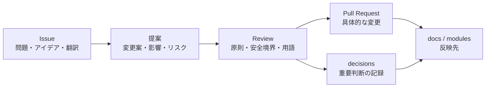

# 提案

このディレクトリには、World Foundation Designの設計変更や新しい仕組みに関する提案を置きます。

提案は、いきなり本体文書を変更するのではなく、まず提案として議論するために使います。重要な提案では [対象外](../../docs/ja/04-non-goals.md)、[脅威モデル](../../docs/ja/05-threat-model.md)、[ガバナンスプロセス](../../assets/diagrams/03-governance-process.md) を確認し、採用された判断は [意思決定](../../decisions/ja/README.md) に残します。

## 位置づけ

## 扱う内容

- 設計変更
- 新しいモジュールや運用手続き
- 既存文書に影響する方針変更
- 重要なリスクや代替案の整理
- docs、modules、glossary、decisionsへの影響

## 命名

初期は `0001-short-title.md` のような連番形式を推奨します。

提案の粒度は小さく保ち、影響する文書やモジュールを明記してください。

## 提案一覧

- [初期ガバナンスプロセス](0001-initial-governance-process.md)
