# Research

This directory contains research notes related to World Foundation Design.

Research should help evaluate risks, historical examples, existing institutions, and possible design choices.

## Research Areas

```mermaid
flowchart TB
  Research["Research"]
  History["Historical and institutional change"]
  War["War and international relations"]
  OSS["OSS and standards"]
  Coop["Cooperatives and mutual aid"]
  Identity["Identity / Reputation"]
  Economy["Economy / Welfare"]
  Governance["Governance / Arbitration / Norms"]
  Safety["Infrastructure / Audit / Safety"]
  Docs["docs / modules<br/>design feedback"]

  Research --> History
  Research --> War
  Research --> OSS
  Research --> Coop
  Research --> Identity
  Research --> Economy
  Research --> Governance
  Research --> Safety
  History --> Docs
  War --> Docs
  OSS --> Docs
  Coop --> Docs
  Identity --> Docs
  Economy --> Docs
  Governance --> Docs
  Safety --> Docs

  click Research "https://github.com/acecore-systems/world-foundation/blob/main/research/en/index.md" "Research index"
  click History "https://github.com/acecore-systems/world-foundation/blob/main/research/en/index.md" "Historical and institutional change"
  click War "https://github.com/acecore-systems/world-foundation/blob/main/research/en/index.md" "War and international relations"
  click OSS "https://github.com/acecore-systems/world-foundation/blob/main/research/en/index.md" "OSS and standards"
  click Coop "https://github.com/acecore-systems/world-foundation/blob/main/research/en/index.md" "Cooperatives and mutual aid"
  click Identity "https://github.com/acecore-systems/world-foundation/blob/main/modules/en/identity/README.md" "Identity / Reputation"
  click Economy "https://github.com/acecore-systems/world-foundation/blob/main/modules/en/economy/README.md" "Economy / Welfare"
  click Governance "https://github.com/acecore-systems/world-foundation/blob/main/modules/en/governance/README.md" "Governance / Arbitration / Norms"
  click Safety "https://github.com/acecore-systems/world-foundation/blob/main/docs/en/05-threat-model.md" "Infrastructure / Audit / Safety"
  click Docs "https://github.com/acecore-systems/world-foundation/blob/main/docs/en/README.md" "design feedback"
```

## Index

Research topics are listed in [index.md](index.md).
