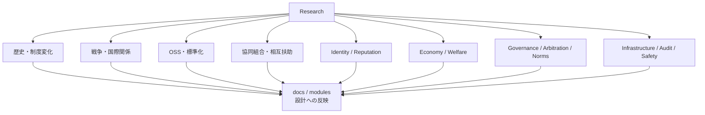

# Research

このディレクトリには、理想的な世界の設計に関係する調査資料を置きます。

調査資料は、思想を補強するためだけでなく、設計上のリスク、失敗例、既存制度との関係を検討するために使います。

## 調査領域

## 対象例

- 歴史
- 国家制度
- 経済制度
- 協同組合
- OSSガバナンス
- 分散ID
- 福祉
- 紛争解決
- 国際関係
- 法制度

## 方針

調査メモには、出典、要約、世界設計への示唆、未確認事項を分けて書くことを推奨します。

## 索引

調査テーマの一覧は [index.md](index.md) に整理します。
