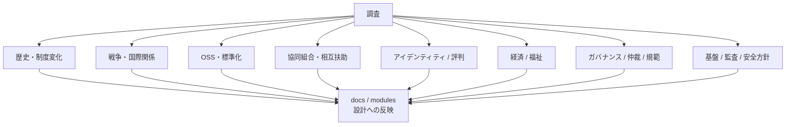

# 調査

このディレクトリには、理想的な世界の設計に関係する調査資料を置きます。

調査資料は、思想を補強するためだけでなく、設計上のリスク、失敗例、既存制度との関係を検討するために使います。調査結果は [ロードマップ](../../docs/ja/03-roadmap.md)、[脅威モデル](../../docs/ja/05-threat-model.md)、各 [モジュール](../../modules/ja/README.md) へ戻し、設計変更が必要な場合は [提案](../../proposals/ja/README.md) として扱います。

## 調査領域

## 対象例

- 歴史
- 国家制度
- 経済制度
- 協同組合
- OSSガバナンス
- 分散ID
- 福祉
- 紛争解決
- 国際関係
- 法制度

## 方針

調査メモには、出典、要約、世界設計への示唆、未確認事項を分けて書くことを推奨します。

## 索引

調査テーマの一覧は [調査索引](index.md) に整理します。
